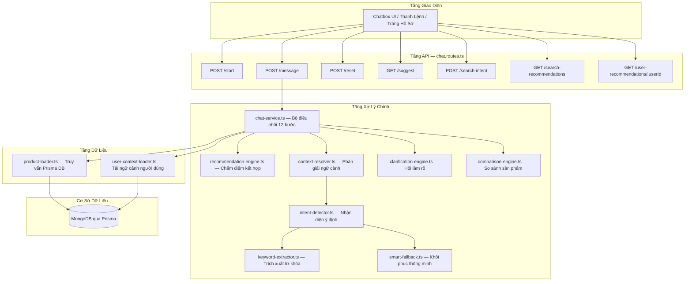
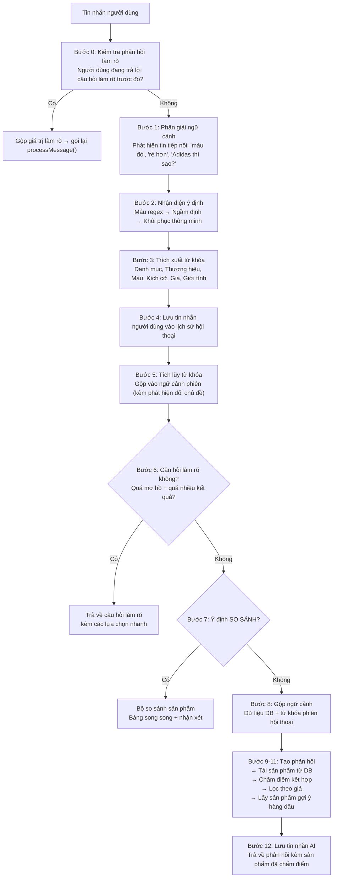
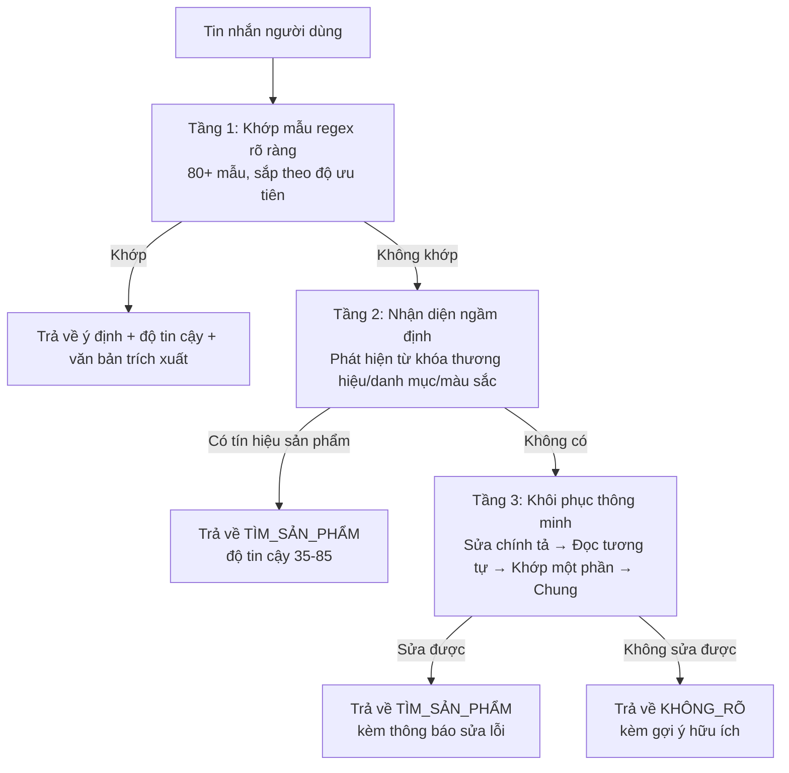

# Recommendation Service — Tài Liệu Kiến Trúc & Thuật Toán Chi Tiết

> Hệ thống Chatbox AI + Gợi Ý Sản Phẩm cho nền tảng E-Commerce SaaS
> Cổng: `6007` | Công nghệ: Express.js + TypeScript + Prisma (MongoDB)

---

## Mục Lục

1. [Tổng Quan Hệ Thống](#1-tổng-quan-hệ-thống)
2. [Sơ Đồ Kiến Trúc](#2-sơ-đồ-kiến-trúc)
3. [Quy Trình Xử Lý Tin Nhắn (12 Bước)](#3-quy-trình-xử-lý-tin-nhắn-12-bước)
4. [Hệ Thống Nhận Diện Ý Định](#4-hệ-thống-nhận-diện-ý-định)
5. [Bộ Trích Xuất Từ Khóa](#5-bộ-trích-xuất-từ-khóa)
6. [Thuật Toán Chấm Điểm Kết Hợp](#6-thuật-toán-chấm-điểm-kết-hợp)
7. [Hệ Thống Phân Giải Ngữ Cảnh](#7-hệ-thống-phân-giải-ngữ-cảnh)
8. [Bộ Hỏi Làm Rõ](#8-bộ-hỏi-làm-rõ)
9. [Bộ Khôi Phục Thông Minh](#9-bộ-khôi-phục-thông-minh)
10. [Bộ So Sánh Sản Phẩm](#10-bộ-so-sánh-sản-phẩm)
11. [Tầng Dữ Liệu](#11-tầng-dữ-liệu)
12. [Danh Sách API](#12-danh-sách-api)
13. [Quản Lý Phiên & Bộ Nhớ](#13-quản-lý-phiên--bộ-nhớ)
14. [Điểm Mạnh & Thiết Kế Nổi Bật](#14-điểm-mạnh--thiết-kế-nổi-bật)
15. [Bản Đồ Tập Tin](#15-bản-đồ-tập-tin)

---

## 1. Tổng Quan Hệ Thống

`recommendation-service` là một **chatbox AI hoàn toàn dựa trên luật (rule-based)**, không phụ thuộc bất kỳ API AI/ML bên ngoài nào (không OpenAI, không Gemini, không dịch vụ cloud ML). Hệ thống cung cấp khả năng tìm kiếm sản phẩm thông minh, chấm điểm gợi ý, so sánh sản phẩm và hỗ trợ hội thoại đa lượt.

### Các Tính Năng Chính

| Tính năng | Mô tả |
|-----------|-------|
| **Chatbox AI** | Khám phá sản phẩm qua hội thoại, hỗ trợ nhiều lượt trao đổi liên tục |
| **Chấm Điểm Kết Hợp** | Công thức 4 chiều: Hội thoại + Hành vi + Độ phổ biến + Giá cả |
| **Tìm Kiếm Thông Minh** | Trích xuất từ khóa, sửa lỗi chính tả (fuzzy matching), nhận diện danh mục/thương hiệu |
| **So Sánh Sản Phẩm** | So sánh song song N sản phẩm với bảng thông số và lời nhận xét tự động |
| **Gợi Ý Tự Động** | Gợi ý theo tiền tố + khớp mờ cho ô nhập liệu tìm kiếm |
| **Gợi Ý Cá Nhân Hóa** | Gợi ý dựa trên lịch sử hành vi cho người dùng đã đăng nhập |
| **Cầu Nối Tìm Kiếm → Gợi ý** | Từ khóa tìm kiếm được ghi lại để tác động vào gợi ý trong tương lai |

### Triết Lý Thiết Kế

- **Không phụ thuộc AI bên ngoài** → Hoàn toàn dựa trên luật, không tốn phí API, không phụ thuộc độ trễ mạng
- **Chấm điểm kết hợp** → Kết hợp 4 tín hiệu thay vì chỉ dựa vào 1 chỉ số duy nhất
- **Suy giảm mềm mại** → Mỗi tầng đều có phương án dự phòng (DB → cache → danh mục demo)
- **Nhận biết phiên hội thoại** → Hội thoại nhiều lượt tích lũy ngữ cảnh tự nhiên

---

## 2. Sơ Đồ Kiến Trúc



### Kích Thước & Vai Trò Từng Module

| Module | Dòng code | Chức năng |
|--------|-----------|-----------|
| `chat-service.ts` | 929 | Bộ điều phối trung tâm, quản lý trạng thái hội thoại, quy trình 12 bước |
| `comparison-engine.ts` | 655 | So sánh N sản phẩm với bảng thông số và phát hiện sản phẩm vượt trội |
| `recommendation-engine.ts` | 548 | Công thức chấm điểm kết hợp 4 chiều |
| `keyword-extractor.ts` | 456 | Trích xuất từ khóa có cấu trúc + sửa lỗi chính tả bằng Levenshtein |
| `product-loader.ts` | 381 | Truy vấn MongoDB với chiến lược thu hẹp dần |
| `smart-fallback.ts` | 370 | Khôi phục 4 tầng khi không nhận diện được ý định |
| `context-resolver.ts` | 304 | Phát hiện tin nhắn tiếp nối & phân giải ngữ cảnh |
| `clarification-engine.ts` | 268 | Quy tắc hỏi làm rõ thông minh |
| `chat.routes.ts` | 670 | Tầng REST API với giới hạn tốc độ gửi tin |

---

## 3. Quy Trình Xử Lý Tin Nhắn (12 Bước)

Hàm `processMessage()` trong `chat-service.ts` xử lý mỗi tin nhắn qua **12 bước tuần tự**:



### Điểm hay của quy trình

- **Xử lý đệ quy khi làm rõ** — Bước 0 tái nhập quy trình với từ khóa đã được bổ sung sau khi người dùng trả lời câu hỏi làm rõ
- **Phát hiện đổi chủ đề** — Bước 5 nhận ra khi người dùng chuyển chủ đề (ví dụ: giày → điện tử) và **xóa trắng** từ khóa tích lũy để tránh bộ lọc cũ gây nhiễu
- **Tìm kiếm thu hẹp dần** — Bước 9 thử truy vấn DB từ hẹp nhất (thương hiệu + danh mục + từ khóa) đến rộng nhất (chỉ từ khóa)
- **Loại trùng khi phân trang** — "Xem thêm" loại bỏ các sản phẩm đã hiển thị trước đó

---

## 4. Hệ Thống Nhận Diện Ý Định

**Tập tin:** `intent-detector.ts` + `intents.config.ts`

### Luồng Nhận Diện 3 Tầng



### 9 Ý Định Được Hỗ Trợ (Theo Độ Ưu Tiên)

| Ý định | Ưu tiên | Ví dụ kích hoạt |
|--------|---------|-----------------|
| `ORDER_STATUS` (Trạng thái đơn) | 105 | "check my order", "delivery status" |
| `SEARCH_PRODUCT` (Tìm sản phẩm) | 100 | "show me Nike shoes", "find me a laptop" |
| `ASK_PRICE` (Hỏi giá) | 90 | "how much", "price of" |
| `ASK_STOCK` (Hỏi tồn kho) | 85 | "is it in stock", "availability" |
| `RECOMMEND` (Gợi ý) | 80 | "recommend", "best sellers", "trending" |
| `COMPARE` (So sánh) | 75 | "Nike vs Adidas", "which is better" |
| `BROWSE` (Duyệt) | 70 | "browse categories" |
| `HELP` (Trợ giúp) | 60 | "help", "what can you do" |
| `GREETING` (Chào hỏi) | 50 | "hi", "hello", "hey" |

### Công Thức Tính Độ Tin Cậy

```
Độ tin cậy = min(điểm_ưu_tiên + điểm_phủ_sóng + thưởng_khớp_chính_xác, 100)

Trong đó:
  điểm_ưu_tiên        = min(ưu_tiên / 2, 50)
  điểm_phủ_sóng       = min(độ_dài_khớp / độ_dài_tin_nhắn × 30, 30)
  thưởng_khớp_chính_xác = 20 nếu toàn bộ tin nhắn khớp hoàn toàn, ngược lại = 0
```

### Thuật Toán Nhận Diện Ngầm Định

Khi không có mẫu regex nào khớp, hệ thống kiểm tra **tín hiệu sản phẩm** bằng tra cứu từ điển với điểm tích lũy:

| Loại tín hiệu | Điểm | Phương pháp |
|---------------|-------|-------------|
| Thương hiệu (chính xác) | +40 | Khớp chuỗi con trong `BRAND_KEYWORDS[]` |
| Thương hiệu (mờ) | +35 | Khoảng cách Levenshtein ≤ 2 |
| Danh mục (chính xác) | +35 | Khớp chuỗi con trong `CATEGORY_KEYWORDS{}` |
| Danh mục (mờ) | +30 | Khoảng cách Levenshtein ≤ 2 |
| Màu sắc (chính xác) | +15 | Biểu thức chính quy ranh giới từ |

Nếu tổng điểm > 0 → phân loại là `SEARCH_PRODUCT` (giới hạn tối đa 85 điểm tin cậy).

---

## 5. Bộ Trích Xuất Từ Khóa

**Tập tin:** `keyword-extractor.ts` + `keywords.config.ts`

### Chiến Lược Trích Xuất Hai Chế Độ

| Truy vấn | Chế độ | Lý do |
|----------|--------|-------|
| **Ngắn** (1-3 từ) | Trích xuất chuẩn: thương hiệu/danh mục/màu/kích cỡ/giá/giới tính | Đủ ngắn để phân tích từng thành phần |
| **Dài** (4+ từ có nghĩa) | Chế độ tìm theo tên sản phẩm: bỏ qua trích xuất cấu trúc, dùng toàn bộ cụm từ làm truy vấn DB | Tránh nhầm lẫn — "Vintage Camel Vegan Leather" sẽ sai khi khớp mờ "Camel" → "Chanel" |

### Quy Trình Trích Xuất

1. **Chuẩn hóa**: chuyển thành chữ thường, xóa khoảng trắng thừa
2. **Kiểm tra chế độ tên sản phẩm**: nếu ≥4 từ có nghĩa + không có tín hiệu giá + không có thương hiệu rõ → bật chế độ tìm theo tên
3. **Trích xuất song song** (chế độ chuẩn):
   - `extractCategories()` — khớp chính xác → khớp mờ
   - `extractBrands()` — khớp chính xác → khớp mờ (ngưỡng ≤ 1)
   - `extractColors()` — biểu thức chính quy ranh giới từ
   - `extractSizes()` — mẫu chữ cái + số
   - `extractPriceRange()` — dưới/trên/khoảng/giữa
   - `extractPriceModifier()` — rẻ/trung bình/đắt
   - `extractGender()` — nam/nữ/trẻ em/unisex
   - Ánh xạ dịp lễ: "gift for her" → danh mục + giới tính
4. **Trích xuất từ khóa thô**: loại bỏ từ dừng (stop words) + bỏ số nhiều ("shirts" → "shirt")

### Thuật Toán Khớp Mờ Levenshtein

Sử dụng **Quy hoạch động** để tính khoảng cách chỉnh sửa giữa 2 chuỗi (thêm, xóa, thay ký tự):

```
levenshteinDistance("adisdas", "adidas") → 1   // hoán vị 's' và 'd'
levenshteinDistance("niike", "nike")     → 1   // thừa chữ 'i'
levenshteinDistance("camel", "chanel")   → 2   // bị chặn bởi danh sách cấm
```

**Ngưỡng thích ứng** theo độ dài từ:
- Từ ≥ 5 ký tự → cho phép khoảng cách tối đa = 2
- Từ < 5 ký tự → cho phép khoảng cách tối đa = 1

### Danh Sách Cấm Khớp Mờ (Chống Nhầm Lẫn)

Một tập hợp ~80 từ **không bao giờ** được khớp mờ, bao gồm:
- **Từ chất liệu**: camel, vegan, vintage, leather, suede, canvas, velvet...
- **Từ bổ nghĩa**: best, most, top, hot, new, good, bad...
- **Màu đặc biệt**: beige, ivory, coral, olive, teal, khaki...

Thiết kế này ngăn chặn: "camel" → "Chanel" (khoảng cách 2), "best" → "belt" (khoảng cách 1).

### Kích Thước Từ Điển

| Từ điển | Số lượng | Nguồn |
|---------|----------|-------|
| Danh mục | 8 nhóm, ~80 từ khóa | `CATEGORY_KEYWORDS` |
| Thương hiệu | 33 thương hiệu | `BRAND_KEYWORDS` |
| Màu sắc | 21 màu | `COLOR_KEYWORDS` |
| Kích cỡ | 11 cỡ chữ + mẫu số | `SIZE_KEYWORDS` |
| Bổ nghĩa giá | 11 từ → 3 mức | `PRICE_MODIFIERS` |
| Giới tính | 13 từ → 4 nhóm | `GENDER_KEYWORDS` |
| Dịp lễ | 17 cụm → danh mục + giới tính | `OCCASION_KEYWORDS` |
| Lĩnh vực thương hiệu | 33 thương hiệu → lĩnh vực | `BRAND_DOMAIN_MAP` |

---

## 6. Thuật Toán Chấm Điểm Kết Hợp

**Tập tin:** `recommendation-engine.ts`

### Công Thức Chính

```
Điểm(P) = α·S_hội_thoại(P) + β·S_hành_vi(P) + γ·S_phổ_biến(P) + δ·S_giá(P)
           + Thưởng_Khớp_Tiêu_Đề

Trong đó:
  α = 0.35 — Mức độ liên quan với hội thoại hiện tại
  β = 0.30 — Mức độ liên quan với lịch sử hành vi người dùng
  γ = 0.20 — Độ phổ biến của sản phẩm
  δ = 0.15 — Mức độ phù hợp với ngân sách

Mỗi điểm thành phần được chuẩn hóa về thang [0, 100].
```

### S_hội_thoại — Điểm Liên Quan Hội Thoại (0–100)

| Tín hiệu | Điểm | Phương pháp |
|-----------|-------|-------------|
| Khớp danh mục | +30 | Danh mục/thẻ sản phẩm khớp với từ khóa hiện tại |
| Khớp thương hiệu | +25 | So sánh thương hiệu chính xác |
| Khớp màu sắc | +10 | So sánh màu chính xác |
| Từ khóa trong tiêu đề (khớp nguyên từ) | +15/từ, tối đa 40 | Biểu thức chính quy ranh giới từ `\b` |
| Từ khóa trong tiêu đề (chỉ chuỗi con) | +4/từ, tối đa 40 | Phép `includes()` |
| Khớp thẻ sản phẩm | +5/thẻ, tối đa 15 | Khớp ranh giới từ |
| Ngữ cảnh hội thoại tích lũy (danh mục) | +8 | Danh mục phiên tích lũy |
| Ngữ cảnh hội thoại tích lũy (thương hiệu) | +8 | Thương hiệu phiên tích lũy |
| Ngữ cảnh hội thoại tích lũy (từ khóa) | +4 | Tiêu đề chứa từ khóa tích lũy |

> **Phân biệt khớp nguyên từ và chuỗi con**: ngăn "phone" tăng điểm cho "headphone" bằng điểm như "phone case".

### S_hành_vi — Điểm Hành Vi Người Dùng (0–100)

| Tín hiệu | Điểm | Logic |
|-----------|-------|-------|
| Không có dữ liệu hành vi | 50 (trung lập) | Không phạt người dùng mới/ẩn danh |
| Đã xem cùng danh mục | +25 | Danh mục trùng với lịch sử xem gần đây |
| Thương hiệu trong giỏ hàng khớp | +20 | Thương hiệu sản phẩm khớp với giỏ hàng |
| Có sản phẩm trong giỏ (bổ trợ) | +10 | Người mua tích cực |
| Đã nằm trong giỏ hàng | −15 | Người dùng đã có sản phẩm này |
| Nằm trong danh sách yêu thích | +10 | Tín hiệu quan tâm vừa phải |
| Khớp sở thích màu sắc | +10 | Từ màu của sản phẩm đã xem |
| Đã xem chính sản phẩm này | −10 | Tránh lặp lại |

### S_phổ_biến — Điểm Độ Phổ Biến (0–100)

| Tín hiệu | Điểm | Cách tính |
|-----------|-------|-----------|
| Đánh giá (rating) | 0-30 | ≥4.5→30, ≥4.0→22, ≥3.5→15, ≥3.0→8 |
| Doanh số gần đây (30 ngày) | 0-30 | Logarit: `log10(số_bán+1) × 16` |
| Thưởng doanh số lịch sử | 0-10 | Logarit: `log10(tổng_bán+1) × 3` |
| Lượt xem | 0-20 | Logarit: `log10(lượt_xem+1) × 5` |
| Thưởng tỷ lệ chuyển đổi | 0-10 | giỏ_hàng/lượt_xem: ≥15%→10, ≥8%→6, ≥3%→3 |

> **Doanh số gần đây được tính trọng số gấp 3 lần** so với tổng doanh số lịch sử — ưu tiên sản phẩm đang thịnh hành.

### S_giá — Điểm Phù Hợp Giá (0–100)

| Nguồn | Logic |
|-------|-------|
| Không có tín hiệu giá | 50 (trung lập) |
| Khoảng giá rõ ràng ("dưới $100") | Trong khoảng → 60 + thưởng điểm ngọt (0-20); Ngoài → 10 |
| Bổ nghĩa giá ("rẻ") | Dưới 60% trung bình → 40; Trên → 10 |
| Khoảng giá suy luận từ hành vi | Trong khoảng → 30; Ngoài → 15 |

### Thưởng Khớp Tiêu Đề Chính Xác (Sau Chấm Điểm)

```
từ_khớp_nguyên = số từ khóa khớp nguyên từ trong tiêu đề
tỷ_lệ_khớp = từ_khớp_nguyên / tổng_từ_khóa

Nếu tỷ_lệ_khớp >= 0.5:
    điểm += round(tỷ_lệ_khớp × 500)   // Thưởng lớn: tối đa +500

Nếu chỉ khớp chuỗi con (ví dụ "phone" trong "headphone"):
    điểm += 20                          // Thưởng nhỏ
```

### Tái Phân Bổ Trọng Số Cho Trang Hồ Sơ

Khi phục vụ gợi ý trên trang hồ sơ (không có hội thoại), trọng số hội thoại (α=0.35) được phân bổ lại theo tỷ lệ:

```
trọng_số_hiệu_lực = {
  hành_vi:    0.30 / 0.65 ≈ 0.46
  phổ_biến:   0.20 / 0.65 ≈ 0.31
  giá:        0.15 / 0.65 ≈ 0.23
}
```

---

## 7. Hệ Thống Phân Giải Ngữ Cảnh

**Tập tin:** `context-resolver.ts`

### 5 Loại Tin Nhắn Tiếp Nối

| Loại | Ví dụ | Hành động |
|------|-------|-----------|
| **Tinh chỉnh** | "in red", "with discount", "also in size 42" | Thêm vào ngữ cảnh hiện có |
| **Chuyển đổi** | "how about Adidas?", "switch to Nike" | Thay thế phần liên quan (thương hiệu) |
| **Bổ sung điều kiện** | "cheaper", "under $100", "$50 to $100" | Thay đổi bộ lọc giá trên kết quả hiện tại |
| **Xác nhận** | "yes", "sure", "sounds good" | Tái sử dụng ngữ cảnh tìm kiếm cuối |
| **Phủ nhận** | "no", "wrong", "not that" | Xóa ngữ cảnh hoặc xử lý phần trích xuất |

### Cơ Chế Bảo Vệ Chống Nhiễu Ngữ Cảnh

Quyết định thiết kế quan trọng: **truy vấn mới đủ cụ thể thì KHÔNG kế thừa ngữ cảnh cũ**.

```
Chat: "show me Nike shoes"     → tích lũy: {thương hiệu: [nike], danh mục: [shoes]}
Chat: "affordable shoes"       → độc lập! (có danh mục + bổ nghĩa = đủ cụ thể)
                                → KHÔNG trở thành "Nike affordable shoes"

Chat: "show me bags"           → tích lũy: {danh mục: [bags]}
Chat: "watches"                → độc lập! (danh mục mới = đổi chủ đề)
                                → KHÔNG trở thành "bags watches"
```

---

## 8. Bộ Hỏi Làm Rõ

**Tập tin:** `clarification-engine.ts`

### Các Quy Tắc Quyết Định

| # | Quy tắc | Điều kiện | Kết quả |
|---|---------|-----------|---------|
| 1 | `TÌM_SẢN_PHẨM` + chỉ có danh mục | Không có thương hiệu, giá, hay màu | Hỏi thương hiệu + khoảng giá |
| 2 | `GỢI_Ý` + không cụ thể | Không có danh mục, thương hiệu, hay từ khóa | Hỏi loại sản phẩm (giày/quần áo/điện tử...) |
| 3 | `HỎI_GIÁ` + quá chung | Chỉ có danh mục, không có thương hiệu | Hỏi thương hiệu/sản phẩm cụ thể |
| 4 | **Tối đa 2 lần làm rõ** mỗi phiên | Đã hỏi ≥ 2 lần → dừng | Hiển thị kết quả trực tiếp |
| 5 | **≥ 3 bộ lọc** đã cung cấp | Có danh mục + thương hiệu + màu/giá/kích cỡ | Bỏ qua làm rõ hoàn toàn |

### Phân Tích Phản Hồi Làm Rõ

Khi người dùng phản hồi câu hỏi, hệ thống nhận biết:
- **Nhấn lựa chọn nhanh** — khớp chính xác nhãn/giá trị
- **Trả lời giá tự do** — "around 200", "about $50", "under 100"
- **Tên thương hiệu** — đối chiếu với `BRAND_KEYWORDS`
- **Nhãn có emoji** — "👟 Shoes" → bỏ emoji → "Shoes"

---

## 9. Bộ Khôi Phục Thông Minh

**Tập tin:** `smart-fallback.ts`

### Quy Trình Khôi Phục 4 Tầng

Khi nhận diện ý định trả về `KHÔNG_RÕ`, bộ khôi phục xử lý qua 4 tầng:

| Tầng | Tên | Thuật toán | Ví dụ | Độ tin cậy |
|------|------|-----------|-------|-----------|
| 1 | Khớp mờ từ điển | Khoảng cách Levenshtein ≤ 2 | "adisdas" → "adidas" | 70 |
| 2 | Khớp phát âm | Thuật toán Soundex | "niike" → "nike" (cùng mã N200) | 55 |
| 3 | Khớp một phần | Tiền tố + Độ tương đồng N-gram | "adi" → "adidas" | 35-45 |
| 4 | Dự phòng chung | Hiển thị sản phẩm thịnh hành | Không sửa được | 10 |

### Thuật Toán Soundex

Ánh xạ từ thành mã phát âm 4 ký tự dựa trên phân loại phụ âm:

```
B,F,P,V → 1    C,G,J,K,Q,S,X,Z → 2    D,T → 3
L → 4           M,N → 5                  R → 6

"Nike"   → N200
"Niike"  → N200  → Khớp!
```

### Độ Tương Đồng N-gram (Chỉ Số Jaccard)

Cho khớp một phần, sử dụng trùng lặp bigram:

```
ngramSimilarity("adi", "adidas") = |{ad,di} ∩ {ad,di,id,da,as}| / |hợp|
                                  = 2/5 = 0.40 → khớp (ngưỡng > 0.40)
```

---

## 10. Bộ So Sánh Sản Phẩm

**Tập tin:** `comparison-engine.ts`

### Luồng So Sánh

1. **Tham chiếu ngữ cảnh** ("compare them/these") → so sánh sản phẩm đã hiển thị (tối đa 5)
2. **Trích xuất chủ thể** từ tin nhắn → phân giải từng chủ thể thành sản phẩm → so sánh
3. **Một chủ thể duy nhất** → ghép cặp với sản phẩm hiển thị cuối hoặc hỏi so với gì

### Các Mẫu Trích Xuất Chủ Thể

| Mẫu | Ví dụ | Kết quả |
|------|-------|---------|
| `A vs B vs C` | "Nike vs Adidas vs Puma shoes" | ["Nike shoes", "Adidas shoes", "Puma shoes"] |
| `A or B or C?` | "iPhone or Samsung or Pixel?" | ["iPhone", "Samsung", "Pixel"] |
| `difference between A and B` | "difference between Mac and Dell" | ["Mac", "Dell"] |
| `compare A and B` | "compare laptop and tablet" | ["laptop", "tablet"] |

### Bảng So Sánh Nhận Biết Thông Số

Với sản phẩm có `customSpecs`, hệ thống tạo bảng so sánh kỹ thuật kèm **xác định sản phẩm vượt trội**:

| Thông số | Biểu tượng | Quy tắc thắng |
|----------|-----------|---------------|
| Vi xử lý | 💻 | không (văn bản) |
| RAM (GB) | 🧠 | cao hơn thắng |
| Bộ nhớ (GB) | 💾 | cao hơn thắng, tự chuyển sang TB |
| Pin (giờ/mAh) | 🔋 | cao hơn thắng |
| Camera (MP) | 📷 | cao hơn thắng |
| Trọng lượng (kg/g) | ⚖️ | nhẹ hơn thắng |

### Cơ Chế Ngăn So Sánh Mơ Hồ

Phát hiện so sánh chỉ thương hiệu ("Nike vs Adidas") và yêu cầu cụ thể hơn:
```
"Tôi có thể so sánh sản phẩm cụ thể, không phải toàn bộ thương hiệu."
Lựa chọn nhanh: ["Nike shirt vs Adidas shirt", "Best Nike products", "Best Adidas products"]
```

---

## 11. Tầng Dữ Liệu

### Bộ Tải Sản Phẩm (`product-loader.ts`)

#### Chiến Lược Tìm Kiếm Thu Hẹp Dần

Khi tìm theo từ khóa, bộ tải thử 4 chiến lược từ **hẹp nhất đến rộng nhất**, dừng ở kết quả đầu tiên thành công:

```
1. từ_khóa + thương_hiệu + danh_mục  → Cụ thể nhất
2. từ_khóa + thương_hiệu              → Theo thương hiệu
3. từ_khóa + danh_mục                  → Theo danh mục
4. chỉ từ_khóa                         → Rộng nhất
```

#### Làm Giàu Doanh Số Gần Đây

Sau khi tải sản phẩm, bổ sung `recentSalesCount` (30 ngày gần nhất) từ bảng `orderItems` bằng truy vấn `groupBy`.

### Bộ Tải Ngữ Cảnh Người Dùng (`user-context-loader.ts`)

Tải 50 hành động gần nhất từ `userAnalytics` và xây dựng `UserContext`:

| Loại hành động | Dữ liệu trích xuất |
|----------------|-------------------|
| `product_view` | Sản phẩm đã xem, danh mục, màu ưa thích, mức giá |
| `add_to_cart` | Sản phẩm trong giỏ, thương hiệu giỏ hàng |
| `remove_from_cart` | Loại khỏi danh sách giỏ |
| `add_to_wishlist` | Sản phẩm yêu thích |
| `purchase` | Tăng trọng số danh mục + thương hiệu, loại khỏi giỏ/yêu thích |
| `search_intent` | Từ khóa tìm kiếm (tách thành từ đơn) |

#### Suy Luận Khoảng Giá

```
Sắp xếp giá các sản phẩm đã xem → lấy trung vị
khoảng_giá = { min: trung_vị × 0.5, max: trung_vị × 2.0 }
```

### Chiến Lược Bộ Nhớ Đệm

| Bộ đệm | Thời gian sống | Giới hạn | Cơ chế loại bỏ |
|---------|---------------|----------|----------------|
| Truy vấn sản phẩm | 3 phút | 200 mục | LRU theo thời gian |
| Doanh số gần đây | 1 phút | Theo ngày | Hết hạn |
| Gợi ý tìm kiếm | 30 giây | 100 mục | Hết hạn |

---

## 12. Danh Sách API

### Các Endpoint Chat (`/api/chat/`)

| Phương thức | Đường dẫn | Mô tả | Tham số |
|------------|-----------|-------|---------|
| `POST` | `/start` | Bắt đầu hội thoại mới | `{ userId?: string }` |
| `POST` | `/message` | Gửi tin nhắn, nhận phản hồi AI | `{ conversationId, message }` |
| `POST` | `/reset` | Khởi động lại hội thoại (phiên mới) | `{ conversationId }` |
| `GET` | `/suggest` | Gợi ý tự động hoàn thành | `?q=tiền_tố` |
| `POST` | `/search-intent` | Ghi lại từ khóa tìm kiếm cho gợi ý tương lai | `{ userId, keyword }` |
| `GET` | `/search-recommendations` | Gợi ý cho Thanh Lệnh (Command Palette) | `?userId=xxx&limit=6` |
| `GET` | `/user-recommendations/:userId` | Gợi ý hồ sơ cá nhân kèm chi tiết điểm | `:userId` |
| `GET` | `/:conversationId` | Lấy thông tin hội thoại | `:conversationId` |
| `GET` | `/:conversationId/history` | Lấy lịch sử tin nhắn | `?limit=20` |
| `GET` | `/:conversationId/context` | Gỡ lỗi: từ khóa tích lũy | `:conversationId` |

### Giới Hạn Tốc Độ

```
5 tin nhắn mỗi 10 giây cho mỗi conversationId
429 Too Many Requests → { retryAfter: số_giây }
```

---

## 13. Quản Lý Phiên & Bộ Nhớ

### Kho Hội Thoại Trong Bộ Nhớ

```
MAX_CONVERSATIONS = 500       // Tối đa phiên đồng thời
SESSION_TTL       = 30 phút   // Hết hạn khi không hoạt động
CLEANUP_INTERVAL  = 5 phút    // Dọn dẹp định kỳ
```

### Thuật Toán Dọn Dẹp

```
Mỗi 5 phút:
  1. Xóa phiên không hoạt động > 30 phút
  2. Nếu vẫn > 500 phiên: loại bỏ phiên cũ nhất theo lastMessageAt
```

---

## 14. Điểm Mạnh & Thiết Kế Nổi Bật

### 🏆 Không Phụ Thuộc AI Bên Ngoài
Toàn bộ hệ thống dựa trên luật. Không cần API key, không tốn phí token, không giới hạn tốc độ, không phụ thuộc độ trễ từ dịch vụ ML đám mây. Mọi thứ chạy cục bộ với nhận diện ý định O(1) và chấm điểm O(n).

### 🏆 Công Thức Chấm Điểm Kết Hợp 4 Chiều
Thay vì sắp xếp theo 1 chỉ số duy nhất (giá, độ phổ biến, mức liên quan), hệ thống kết hợp 4 tín hiệu độc lập với trọng số có thể cấu hình. Kết quả xếp hạng tinh tế hơn bất kỳ cách tiếp cận đơn nhân tố nào.

### 🏆 Khôi Phục Lỗi 4 Tầng
Bộ khôi phục thông minh đảm bảo người dùng hầu như không bao giờ thấy "Tôi không hiểu":
1. Levenshtein → bắt lỗi chính tả
2. Soundex → bắt lỗi phát âm
3. N-gram → bắt từ không đầy đủ
4. Chung → hiển thị sản phẩm thịnh hành

### 🏆 Phát Hiện Đổi Chủ Đề
Hàm `accumulateKeywords()` phát hiện khi người dùng chuyển chủ đề và **xóa sạch ngữ cảnh** thay vì làm nhiễu tìm kiếm mới. Thiết kế tinh tế nhưng quan trọng cho hội thoại nhiều lượt.

### 🏆 Chống Nhầm Lẫn Khớp Mờ
`FUZZY_BLOCKLIST` ngăn từ chất liệu ("camel", "leather") khớp mờ sang tên thương hiệu ("Chanel"). Ngưỡng thích ứng theo độ dài từ.

### 🏆 Phân Biệt Khớp Nguyên Từ và Chuỗi Con
Bộ chấm điểm phân biệt `\bphone\b` (khớp nguyên từ, 15 điểm) và "headphone" (chỉ chuỗi con, 4 điểm). Ngăn sản phẩm không liên quan xếp hạng cao.

### 🏆 Tìm Kiếm Thu Hẹp Dần
Bộ tải sản phẩm thử **truy vấn hẹp nhất trước** rồi mở rộng dần. Tối đa hóa độ chính xác đồng thời đảm bảo luôn có kết quả.

### 🏆 Bảng So Sánh Nhận Biết Thông Số
Bộ so sánh tự phát hiện `customSpecs` và tạo bảng kỹ thuật kèm quy tắc xác định sản phẩm vượt trội (RAM cao hơn thắng, trọng lượng nhẹ hơn thắng).

### 🏆 Theo Dõi Giá Tương Đối
Khi người dùng nói "rẻ hơn", hệ thống tính phân vị 25% giá sản phẩm đã hiển thị và đặt làm giá tối đa mới. "Đắt hơn" dùng phân vị 75%.

### 🏆 Cầu Nối Tìm Kiếm → Gợi Ý
Endpoint `search-intent` ghi từ khóa tìm kiếm vào `userAnalytics`, nên lịch sử thanh tìm kiếm ảnh hưởng đến gợi ý chatbox trong tương lai. Tạo **vòng lặp học tập giữa các tính năng** mà không cần ML.

### 🏆 Phát Hiện Xung Đột Thương Hiệu — Danh Mục
Cơ chế bảo vệ tự phát hiện sự kết hợp không tương thích (ví dụ "Zara iPhone" → thương hiệu thời trang + từ khóa điện tử) và hỏi làm rõ thay vì trả về kết quả sai.

### 🏆 Tái Phân Bổ Trọng Số Cho Trang Hồ Sơ
Khi phục vụ gợi ý không có ngữ cảnh hội thoại, trọng số hội thoại (35%) được tái phân bổ toán học theo tỷ lệ: hành vi (46%), phổ biến (31%), giá (23%).

---

## 15. Bản Đồ Tập Tin

```
apps/recommendation-service/
├── src/
│   ├── main.ts                          # Khởi động Express server, cổng 6007
│   ├── core/
│   │   ├── chat-service.ts              # Bộ điều phối trung tâm, quy trình 12 bước
│   │   ├── intent-detector.ts           # Nhận diện ý định 3 tầng
│   │   ├── keyword-extractor.ts         # Trích xuất có cấu trúc + khớp mờ Levenshtein
│   │   ├── recommendation-engine.ts     # Chấm điểm kết hợp (α·β·γ·δ)
│   │   ├── context-resolver.ts          # Phát hiện & phân giải tin tiếp nối
│   │   ├── clarification-engine.ts      # Quy tắc hỏi làm rõ thông minh
│   │   ├── smart-fallback.ts            # Khôi phục lỗi 4 tầng
│   │   ├── comparison-engine.ts         # So sánh N sản phẩm
│   │   └── product-fetcher.ts           # API REST + danh mục demo dự phòng
│   ├── config/
│   │   ├── intents.config.ts            # 9 ý định, mẫu regex, mẫu phản hồi
│   │   └── keywords.config.ts           # Từ điển, ánh xạ lĩnh vực thương hiệu
│   ├── data/
│   │   ├── product-loader.ts            # Truy vấn Prisma DB, tìm kiếm thu hẹp dần
│   │   └── user-context-loader.ts       # userAnalytics → UserContext
│   ├── routes/
│   │   └── chat.routes.ts               # API REST, giới hạn tốc độ, tất cả endpoint
│   └── __tests__/
│       ├── intent-detector.test.ts
│       ├── simple-test.ts
│       ├── run-phase1-tests.ts
│       ├── test-phase2.ts
│       ├── test-phase4.ts
│       ├── test-phase5.ts
│       ├── test-phase6.ts
│       └── test-phase7-e2e.ts
├── package.json
├── tsconfig.json
└── webpack.config.js
```
