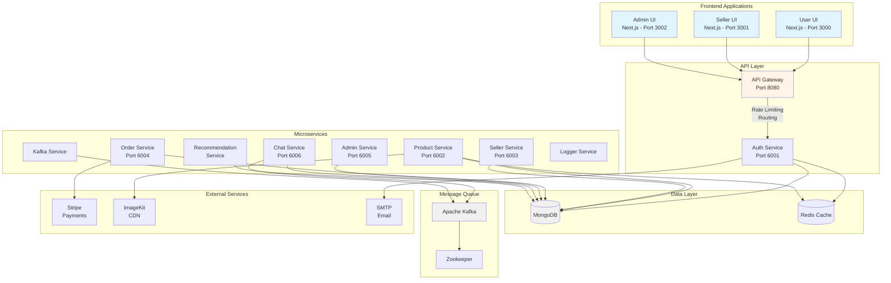

# 🛍️ E-Commerce SaaS Platform

> A modern, scalable, full-featured e-commerce platform built with microservices architecture and Next.js

[](https://opensource.org/licenses/MIT)
[](https://nx.dev)
[](https://www.typescriptlang.org/)
[](https://nextjs.org/)

## 📋 Table of Contents

- [Overview](#-overview)
- [Features](#-features)
- [Architecture](#-architecture)
- [Tech Stack](#-tech-stack)
- [Prerequisites](#-prerequisites)
- [Installation](#-installation)
- [Configuration](#-configuration)
- [Running the Project](#-running-the-project)
- [Project Structure](#-project-structure)
- [API Documentation](#-api-documentation)
- [Development](#-development)
- [Contributing](#-contributing)
- [License](#-license)

## 🌟 Overview

This is a comprehensive e-commerce SaaS platform built using a modern microservices architecture. The platform supports multiple vendors (sellers), provides a rich user shopping experience, and includes powerful admin capabilities. Built with scalability, maintainability, and performance in mind using Nx monorepo tooling.

### Key Capabilities

- **Multi-vendor marketplace** - Allow multiple sellers to manage their own shops and products
- **Real-time chat** - Communication between buyers and sellers using Kafka messaging
- **Advanced analytics** - Track user behavior, product performance, and shop metrics
- **Payment processing** - Integrated Stripe payment gateway
- **Media management** - ImageKit CDN for optimized image delivery
- **Recommendation engine** - AI-powered product recommendations
- **Responsive UI** - Modern Next.js applications for users, sellers, and admins

## ✨ Features

### For Customers (User UI)

- 🛒 **Shopping Cart & Checkout** - Seamless shopping experience with cart management
- 💳 **Multiple Payment Options** - Stripe integration with various payment methods
- 🔍 **Advanced Search & Filters** - Find products easily with smart filtering
- ⭐ **Reviews & Ratings** - Rate and review products and shops
- 📱 **Responsive Design** - Mobile-first responsive interface
- 💬 **Real-time Chat** - Communicate directly with sellers
- 📊 **Order Tracking** - Track order status and delivery
- ❤️ **Wishlist** - Save favorite products for later
- 🏠 **Address Management** - Manage multiple shipping addresses
- 🔔 **Notifications** - Real-time updates on orders and promotions

### For Sellers (Seller UI)

- 🏪 **Shop Management** - Create and customize your shop
- 📦 **Product Management** - Add, edit, and manage products with rich media
- 📈 **Analytics Dashboard** - Track sales, visitors, and performance metrics
- 💰 **Financial Reports** - Revenue tracking and financial analytics
- 🎫 **Discount Codes** - Create and manage promotional codes
- 📮 **Order Management** - Process and fulfill customer orders
- 💬 **Customer Communication** - Chat with customers in real-time
- ⭐ **Reviews Management** - Monitor and respond to reviews
- 🔔 **Notifications** - Get notified about new orders and messages

### For Administrators (Admin UI)

- 👥 **User Management** - Manage users, sellers, and permissions
- 🏪 **Shops Management** - Oversee all shops and vendors
- 📊 **System Analytics** - Platform-wide analytics and insights
- 🛡️ **Content Moderation** - Review and approve products/shops
- ⚙️ **Site Configuration** - Manage categories, settings, and configurations
- 📧 **Notifications System** - Send system-wide announcements
- 🔍 **Advanced Reporting** - Generate comprehensive reports

### Technical Features

- 🔒 **Authentication & Authorization** - JWT-based secure authentication
- 🚀 **Microservices Architecture** - Scalable independent services
- 📨 **Event-Driven Design** - Kafka for async communication
- 💾 **MongoDB Database** - Flexible NoSQL database with Prisma ORM
- ⚡ **Redis Caching** - Fast data caching with Upstash Redis
- 📧 **Email Service** - Automated email notifications
- 🔄 **Rate Limiting** - API protection with request throttling
- 📝 **API Documentation** - Swagger/OpenAPI documentation
- 🐳 **Docker Support** - Containerized deployment ready
- 🧪 **Testing** - Jest testing framework setup

## 🏗️ Architecture

This project follows a **microservices architecture** pattern using Nx monorepo tooling.



### Service Responsibilities

| Service                    | Port | Description                                                |
| -------------------------- | ---- | ---------------------------------------------------------- |
| **API Gateway**            | 8080 | Entry point, routing, rate limiting, CORS handling         |
| **Auth Service**           | 6001 | User/seller authentication, JWT tokens, session management |
| **Product Service**        | 6002 | Product CRUD, categories, search, product analytics        |
| **Seller Service**         | 6003 | Shop management, seller profiles, shop analytics           |
| **Order Service**          | 6004 | Order processing, checkout, payment integration            |
| **Admin Service**          | 6005 | Admin operations, site config, user management             |
| **Chat Service**           | 6006 | Real-time messaging via Kafka                              |
| **Kafka Service**          | -    | Message broker management, event publishing                |
| **Logger Service**         | -    | Centralized logging across services                        |
| **Recommendation Service** | -    | AI-powered product recommendations                         |

## 🛠️ Tech Stack

### Frontend

- **Framework**: [Next.js 15.2](https://nextjs.org/) (React 19)
- **Styling**: [Tailwind CSS 3.4](https://tailwindcss.com/)
- **State Management**:
  - [Zustand](https://github.com/pmndrs/zustand) - Global state
  - [Jotai](https://jotai.org/) - Atomic state
  - [TanStack Query](https://tanstack.com/query) - Server state
- **Forms**: [React Hook Form](https://react-hook-form.com/)
- **UI Components**:
  - [Lucide Icons](https://lucide.dev/)
  - [Framer Motion](https://www.framer.com/motion/) - Animations
  - [React Quill](https://www.npmjs.com/package/react-quill-new) - Rich text editor
  - [ApexCharts](https://apexcharts.com/) / [Recharts](https://recharts.org/) - Data visualization
  - [React Table](https://tanstack.com/table) - Table management
- **Other**:
  - [Axios](https://axios-http.com/) - HTTP client
  - [React Hot Toast](https://react-hot-toast.com/) - Notifications

### Backend

- **Runtime**: [Node.js](https://nodejs.org/)
- **Framework**: [Express.js](https://expressjs.com/)
- **Language**: [TypeScript 5.9](https://www.typescriptlang.org/)
- **Database ORM**: [Prisma 6.17](https://www.prisma.io/)
- **API Documentation**: [Swagger UI](https://swagger.io/)

### Database & Caching

- **Database**: [MongoDB](https://www.mongodb.com/) - NoSQL database
- **Cache**: [Upstash Redis](https://upstash.com/) - Serverless Redis
- **ODM**: [Prisma Client](https://www.prisma.io/docs/concepts/components/prisma-client)

### Message Queue

- **Message Broker**: [Apache Kafka](https://kafka.apache.org/)
- **Client**: [KafkaJS](https://kafka.js.org/)
- **Coordination**: [Apache Zookeeper](https://zookeeper.apache.org/)

### External Services

- **Payments**: [Stripe](https://stripe.com/)
- **Media Storage**: [ImageKit](https://imagekit.io/)
- **Email**: [Nodemailer](https://nodemailer.com/) with SMTP

### Development Tools

- **Monorepo**: [Nx 21.5](https://nx.dev/)
- **Build**: [Webpack](https://webpack.js.org/), [esbuild](https://esbuild.github.io/)
- **Testing**: [Jest](https://jestjs.io/)
- **Containerization**: [Docker](https://www.docker.com/)
- **Code Quality**: TypeScript, ESLint

## 📦 Prerequisites

Before you begin, ensure you have the following installed:

- **Node.js**: v20.x or higher ([Download](https://nodejs.org/))
- **npm**: v10.x or higher (comes with Node.js)
- **MongoDB**: Local or cloud instance ([MongoDB Atlas](https://www.mongodb.com/cloud/atlas))
- **Docker**: For running Kafka (optional but recommended) ([Download](https://www.docker.com/))
- **Git**: Version control ([Download](https://git-scm.com/))

### External Service Accounts

You'll need accounts for these services:

- [MongoDB Atlas](https://www.mongodb.com/cloud/atlas) - Database
- [Upstash Redis](https://upstash.com/) - Caching
- [Stripe](https://stripe.com/) - Payment processing
- [ImageKit](https://imagekit.io/) - Image CDN
- Gmail or SMTP provider - Email service

## 🚀 Installation

### 1. Clone the Repository

```bash
git clone https://github.com/khiemvuong/e-commerce-saas.git
cd e-commerce-saas
```

### 2. Install Dependencies

```bash
npm install
```

This will install all dependencies for all applications and services in the monorepo.

### 3. Setup Kafka (Message Queue)

Start Kafka and Zookeeper using Docker Compose:

```bash
docker-compose up -d
```

This will start:

- Zookeeper on port `2181`
- Kafka broker on port `9092`
- Auto-create required topics (`chat.new_messages`)

Verify Kafka is running:

```bash
docker ps
```

## ⚙️ Configuration

### 1. Environment Variables

Create a `.env` file in the root directory by copying the example:

```bash
cp .env.example .env
```

### 2. Configure Environment Variables

Edit `.env` file with your credentials:

```env
# Database
DATABASE_URL="mongodb+srv://<username>:<password>@<cluster>.mongodb.net/<database>"

# Redis Cache
UPSTASH_REDIS_REST_URL="https://your-redis-instance.upstash.io"
UPSTASH_REDIS_REST_TOKEN="your_redis_token"

# SMTP Email Configuration
SMTP_USER="your_email@gmail.com"
SMTP_PASS="your_app_specific_password"
SMTP_PORT=465
SMTP_SERVICE=gmail
SMTP_HOST=smtp.gmail.com

# JWT Secrets (Generate secure random strings)
ACCESS_TOKEN_SECRET="your_access_token_secret"
REFRESH_TOKEN_SECRET="your_refresh_token_secret"

# Stripe Payment
STRIPE_SECRET_KEY="sk_test_your_stripe_secret_key"

# ImageKit CDN
IMAGEKIT_PRIVATE_KEY="private_your_imagekit_private_key"
```

> **Security Note**: Never commit the `.env` file to version control. Keep your secrets safe!

### 3. Database Setup

Generate Prisma client and push schema to MongoDB:

```bash
npx prisma generate
npx prisma db push
```

### 4. Initialize Site Configuration

The site configuration (categories, subcategories) will be automatically initialized when you start the API Gateway for the first time.

## 🏃 Running the Project

### Development Mode

#### Run All Services Simultaneously

```bash
npm run dev
```

This will start:

- API Gateway (Port 8080)
- Auth Service (Port 6001)
- Product Service (Port 6002)
- Seller Service (Port 6003)
- Order Service (Port 6004)
- Admin Service (Port 6005)
- Chat Service (Port 6006)
- Recommendation Service
- Kafka Service
- Logger Service

#### Run Frontend Applications

**User Interface:**

```bash
npm run user-ui
# Runs on http://localhost:3000
```

**Seller Dashboard:**

```bash
npm run seller-ui
# Runs on http://localhost:3001
```

**Admin Dashboard:**

```bash
npm run admin-ui
# Runs on http://localhost:3002
```

#### Run Individual Services

```bash
# Run a specific service
npx nx serve <service-name>

# Examples:
npx nx serve auth-service
npx nx serve product-service
npx nx serve user-ui
```

### Production Build

```bash
# Build all applications
npx nx run-many --target=build --all

# Build specific application
npx nx build <app-name>
```

### Accessing the Applications

Once running, access the applications at:

- **User Interface**: [http://localhost:3000](http://localhost:3000)
- **Seller Dashboard**: [http://localhost:3001](http://localhost:3001)
- **Admin Dashboard**: [http://localhost:3002](http://localhost:3002)
- **API Gateway**: [http://localhost:8080](http://localhost:8080)

## 📁 Project Structure

```
e-commerce-saas/
├── apps/                          # All applications
│   ├── user-ui/                  # Customer frontend (Next.js)
│   ├── seller-ui/                # Seller dashboard (Next.js)
│   ├── admin-ui/                 # Admin dashboard (Next.js)
│   ├── api-gateway/              # API Gateway service
│   ├── auth-service/             # Authentication service
│   ├── product-service/          # Product management service
│   ├── seller-service/           # Seller/shop management
│   ├── order-service/            # Order processing service
│   ├── admin-service/            # Admin operations service
│   ├── chatting-service/         # Real-time chat service
│   ├── kafka-service/            # Kafka message broker
│   ├── logger-service/           # Centralized logging
│   └── recommendation-service/   # AI recommendations
│
├── packages/                      # Shared packages
│   ├── components/               # Shared React components
│   ├── utils/                    # Utility functions
│   ├── libs/                     # Shared libraries
│   ├── middleware/               # Express middleware
│   └── error-handler/            # Error handling utilities
│
├── prisma/                        # Database
│   └── schema.prisma             # Prisma schema definition
│
├── .env.example                   # Environment variables template
├── docker-compose.yml            # Docker Compose for Kafka
├── nx.json                       # Nx workspace configuration
├── package.json                  # Root package dependencies
├── tsconfig.base.json            # Base TypeScript config
└── README.md                     # This file
```

### Application Details

#### Frontend Applications (`apps/`)

- **user-ui**: Customer-facing e-commerce interface

  - Product browsing and search
  - Shopping cart and checkout
  - Order tracking
  - Account management
  - Chat with sellers

- **seller-ui**: Seller dashboard for shop management

  - Product management (CRUD)
  - Order fulfillment
  - Analytics and reports
  - Shop customization
  - Customer communication

- **admin-ui**: Administrative control panel
  - User and seller management
  - Platform analytics
  - Content moderation
  - Site configuration
  - System monitoring

#### Backend Services (`apps/`)

All services are built with Express.js and TypeScript:

- **api-gateway**: Central entry point

  - Routes requests to appropriate services
  - Rate limiting
  - CORS management
  - Request/response logging

- **auth-service**: Authentication & authorization

  - User/seller registration and login
  - JWT token generation and validation
  - Password management
  - Session handling

- **product-service**: Product management

  - CRUD operations for products
  - Category management
  - Product search and filtering
  - Product analytics tracking
  - Image upload to ImageKit

- **seller-service**: Shop management

  - Shop creation and configuration
  - Seller profiles
  - Shop analytics
  - Follower management
  - Shop reviews

- **order-service**: Order processing

  - Cart management
  - Checkout process
  - Stripe payment integration
  - Order status tracking
  - Discount code application

- **admin-service**: Administrative functions

  - User management
  - Site configuration
  - Category management
  - Platform-wide analytics

- **chatting-service**: Real-time messaging

  - WebSocket/Kafka-based chat
  - Conversation management
  - Message persistence
  - Online status tracking

- **kafka-service**: Event streaming

  - Message broker setup
  - Event publishing and consumption
  - Topic management

- **logger-service**: Logging

  - Centralized log aggregation
  - Error tracking

- **recommendation-service**: AI recommendations
  - User behavior tracking
  - Product recommendation algorithm
  - Personalized suggestions

#### Shared Packages (`packages/`)

- **components**: Reusable React components
- **utils**: Shared utility functions (date formatting, validation, etc.)
- **libs**: Common libraries and helpers
- **middleware**: Express middleware (auth, error handling)
- **error-handler**: Standardized error handling

## 📚 API Documentation

API documentation is available via Swagger UI for each service:

### Generate Documentation

```bash
# Auth Service API docs
npm run auth-docs

# Product Service API docs
npm run product-docs
```

### Access Swagger UI

After starting the services, access the interactive API documentation:

- **Auth Service**: `http://localhost:6001/api-docs`
- **Product Service**: `http://localhost:6002/api-docs`

### API Endpoints Overview

#### Authentication Service (`/auth`)

- `POST /api/register` - Register new user/seller
- `POST /api/login` - Login
- `POST /api/logout` - Logout
- `GET /api/refresh` - Refresh access token
- `GET /api/me` - Get current user

#### Product Service (`/product`)

- `GET /api/products` - Get all products (with filters)
- `GET /api/products/:id` - Get product by ID
- `POST /api/products` - Create product
- `PUT /api/products/:id` - Update product
- `DELETE /api/products/:id` - Delete product
- `GET /api/categories` - Get categories

#### Seller Service (`/seller`)

- `GET /api/shops` - Get all shops
- `GET /api/shops/:id` - Get shop details
- `POST /api/shops` - Create shop
- `PUT /api/shops/:id` - Update shop
- `POST /api/shops/:id/follow` - Follow shop

#### Order Service (`/order`)

- `GET /api/orders` - Get user orders
- `POST /api/orders` - Create order
- `PUT /api/orders/:id` - Update order status
- `POST /api/checkout` - Process checkout

#### Chat Service (`/chatting`)

- `GET /api/conversations` - Get conversations
- `POST /api/conversations` - Create conversation
- `POST /api/messages` - Send message
- `GET /api/messages/:id` - Get conversation messages

## 💻 Development

### Nx Commands

```bash
# View project graph
npx nx graph

# Run tests
npx nx test <project-name>

# Lint code
npx nx lint <project-name>

# See all available targets for a project
npx nx show project <project-name>

# Generate a new app
npx nx g @nx/node:app <app-name>

# Generate a new library
npx nx g @nx/node:lib <lib-name>
```

### Code Organization

- Use **TypeScript** for all code
- Follow **functional programming** principles where possible
- Use **async/await** for asynchronous operations
- Implement proper **error handling** in all services
- Write **tests** for critical business logic
- Document complex logic with comments

### Database Migrations

When you modify the Prisma schema:

```bash
# Update the schema
npx prisma format

# Generate new Prisma client
npx prisma generate

# Push changes to database
npx prisma db push

# Open Prisma Studio to view data
npx prisma studio
```

### Adding New Features

1. Create feature branch: `git checkout -b feature/your-feature`
2. Make changes in appropriate service/app
3. Update tests if needed
4. Test locally
5. Commit and push
6. Create pull request

## 🤝 Contributing

Contributions are welcome! Please follow these steps:

1. Fork the repository
2. Create a feature branch (`git checkout -b feature/amazing-feature`)
3. Commit your changes (`git commit -m 'Add some amazing feature'`)
4. Push to the branch (`git push origin feature/amazing-feature`)
5. Open a Pull Request

### Coding Standards

- Follow TypeScript best practices
- Use meaningful variable and function names
- Write clean, readable code
- Add comments for complex logic
- Ensure all tests pass before submitting PR
- Update documentation as needed

## 📄 License

This project is licensed under the MIT License - see the [LICENSE](LICENSE) file for details.

## 🙏 Acknowledgments

- Built with [Nx](https://nx.dev) - Smart Monorepos
- UI powered by [Next.js](https://nextjs.org/)
- Styled with [Tailwind CSS](https://tailwindcss.com/)
- Database by [MongoDB](https://www.mongodb.com/) & [Prisma](https://www.prisma.io/)
- Message queue by [Apache Kafka](https://kafka.apache.org/)

---

<div align="center">
Made with ❤️ by khiemvuong
</div>
