# Tài liệu Use Case - E-Commerce SaaS Platform

## Mục lục

1. [Tổng quan hệ thống](#1-tổng-quan-hệ-thống)
2. [Actors (Tác nhân)](#2-actors-tác-nhân)
3. [Use Cases Quản lý Người dùng](#3-use-cases-quản-lý-người-dùng)
4. [Use Cases Quản lý Seller](#4-use-cases-quản-lý-seller)
5. [Use Cases Quản lý Sản phẩm](#5-use-cases-quản-lý-sản-phẩm)
6. [Use Cases Đặt hàng & Thanh toán](#6-use-cases-đặt-hàng--thanh-toán)
7. [Use Cases Chat & Nhắn tin](#7-use-cases-chat--nhắn-tin)
8. [Use Cases Quản trị Admin](#8-use-cases-quản-trị-admin)

---

## 1. Tổng quan hệ thống

Hệ thống E-commerce SaaS là nền tảng thương mại điện tử đa người bán (multi-vendor) được xây dựng theo kiến trúc microservices, bao gồm:

- **API Gateway**: Điểm vào duy nhất, rate limiting, routing
- **Auth Service**: Xác thực và ủy quyền
- **Product Service**: Quản lý sản phẩm, danh mục
- **Order Service**: Đặt hàng, thanh toán Stripe
- **Seller Service**: Quản lý cửa hàng, analytics
- **Chatting Service**: Nhắn tin real-time (WebSocket/Kafka)
- **Admin Service**: Quản trị hệ thống

---

## 2. Actors (Tác nhân)

| Actor      | Mô tả                                     |
| ---------- | ----------------------------------------- |
| **User**   | Khách hàng mua sắm trên hệ thống          |
| **Seller** | Người bán, quản lý cửa hàng và sản phẩm   |
| **Admin**  | Quản trị viên hệ thống                    |
| **System** | Các tiến trình tự động (Kafka, Cron Jobs) |

### Sơ đồ Use Case Tổng quan

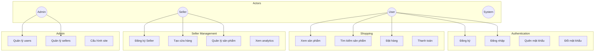
```mermaid
graph TB
    subgraph Actors
        U((User))
        S((Seller))
        A((Admin))
        SYS((System))
    end

    subgraph "Authentication"
        UC1[Đăng ký]
        UC2[Đăng nhập]
        UC3[Quên mật khẩu]
        UC4[Đổi mật khẩu]
    end

    subgraph "Shopping"
        UC5[Xem sản phẩm]
        UC6[Tìm kiếm sản phẩm]
        UC7[Đặt hàng]
        UC8[Thanh toán]
    end

    subgraph "Seller Management"
        UC9[Đăng ký Seller]
        UC10[Tạo cửa hàng]
        UC11[Quản lý sản phẩm]
        UC12[Xem analytics]
    end

    subgraph "Admin"
        UC13[Quản lý users]
        UC14[Quản lý sellers]
        UC15[Cấu hình site]
    end

    U --> UC1
    U --> UC2
    U --> UC5
    U --> UC6
    U --> UC7
    S --> UC9
    S --> UC10
    S --> UC11
    A --> UC13
    A --> UC14
```

---

## 3. Use Cases Quản lý Người dùng

### UC-01: Đăng ký tài khoản User

| Thuộc tính         | Chi tiết                                            |
| ------------------ | --------------------------------------------------- |
| **Tên**            | Đăng ký tài khoản User                              |
| **Actor**          | User                                                |
| **Mô tả**          | Cho phép người dùng mới tạo tài khoản trên hệ thống |
| **Tiền điều kiện** | Email chưa được đăng ký                             |
| **Hậu điều kiện**  | Tài khoản được tạo, OTP được gửi qua email          |

**Luồng chính:**

1. User truy cập trang đăng ký
2. User nhập thông tin: name, email, password
3. Hệ thống validate dữ liệu
4. Hệ thống kiểm tra email chưa tồn tại
5. Hệ thống tạo OTP và gửi email
6. User nhập OTP xác thực
7. Hệ thống tạo tài khoản và trả về tokens

**Luồng ngoại lệ:**

- 4a. Email đã tồn tại → Thông báo lỗi
- 6a. OTP sai/hết hạn → Cho phép gửi lại

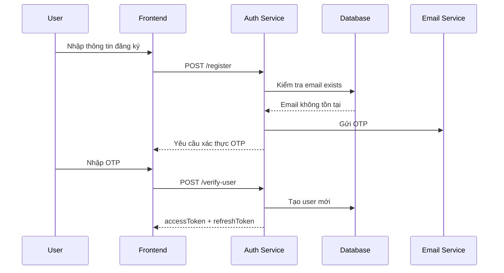
```mermaid
sequenceDiagram
    participant U as User
    participant FE as Frontend
    participant AS as Auth Service
    participant DB as Database
    participant EM as Email Service

    U->>FE: Nhập thông tin đăng ký
    FE->>AS: POST /register
    AS->>DB: Kiểm tra email exists
    DB-->>AS: Email không tồn tại
    AS->>EM: Gửi OTP
    AS-->>FE: Yêu cầu xác thực OTP
    U->>FE: Nhập OTP
    FE->>AS: POST /verify-user
    AS->>DB: Tạo user mới
    AS-->>FE: accessToken + refreshToken
```

### UC-02: Đăng nhập User

| Thuộc tính         | Chi tiết                                        |
| ------------------ | ----------------------------------------------- |
| **Tên**            | Đăng nhập User                                  |
| **Actor**          | User                                            |
| **Mô tả**          | User đăng nhập vào hệ thống bằng email/password |
| **Tiền điều kiện** | User có tài khoản đã được xác thực              |
| **Hậu điều kiện**  | User nhận được access token và refresh token    |

**Luồng chính:**

1. User nhập email và password
2. Hệ thống xác thực thông tin
3. Hệ thống tạo access token (15 phút) và refresh token (7 ngày)
4. Trả về user info và tokens

**Luồng ngoại lệ:**

- 2a. Email không tồn tại → "User not found with this email"
- 2b. Password sai → "Invalid password"

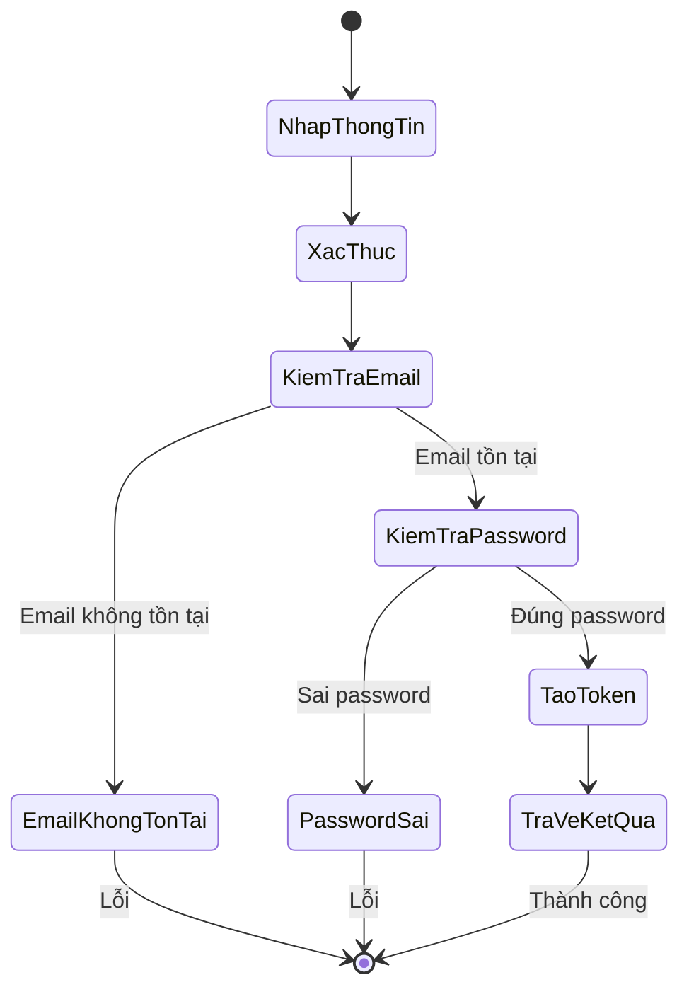
```mermaid
stateDiagram-v2
    [*] --> NhapThongTin
    NhapThongTin --> XacThuc
    XacThuc --> KiemTraEmail
    KiemTraEmail --> EmailKhongTonTai: Email không tồn tại
    KiemTraEmail --> KiemTraPassword: Email tồn tại
    EmailKhongTonTai --> [*]: Lỗi
    KiemTraPassword --> PasswordSai: Sai password
    KiemTraPassword --> TaoToken: Đúng password
    PasswordSai --> [*]: Lỗi
    TaoToken --> TraVeKetQua
    TraVeKetQua --> [*]: Thành công
```

### UC-03: Quên mật khẩu

| Thuộc tính         | Chi tiết                                       |
| ------------------ | ---------------------------------------------- |
| **Tên**            | Quên mật khẩu                                  |
| **Actor**          | User                                           |
| **Mô tả**          | Cho phép user khôi phục mật khẩu qua email OTP |
| **Tiền điều kiện** | Email đã được đăng ký                          |
| **Hậu điều kiện**  | Mật khẩu được cập nhật thành công              |

**Luồng chính:**

1. User nhập email vào form quên mật khẩu
2. Hệ thống kiểm tra email tồn tại
3. Hệ thống tạo OTP và gửi qua email
4. User nhập OTP để xác thực
5. Hệ thống verify OTP thành công
6. User nhập mật khẩu mới (min 8 ký tự)
7. Hệ thống hash và cập nhật mật khẩu

**Luồng ngoại lệ:**

- 2a. Email không tồn tại → "User not found with this email"
- 4a. OTP sai → "Invalid OTP" (cho phép thử lại 3 lần)
- 4b. OTP hết hạn (5 phút) → "OTP expired, please request again"
- 6a. Password không đủ mạnh → Thông báo validation error

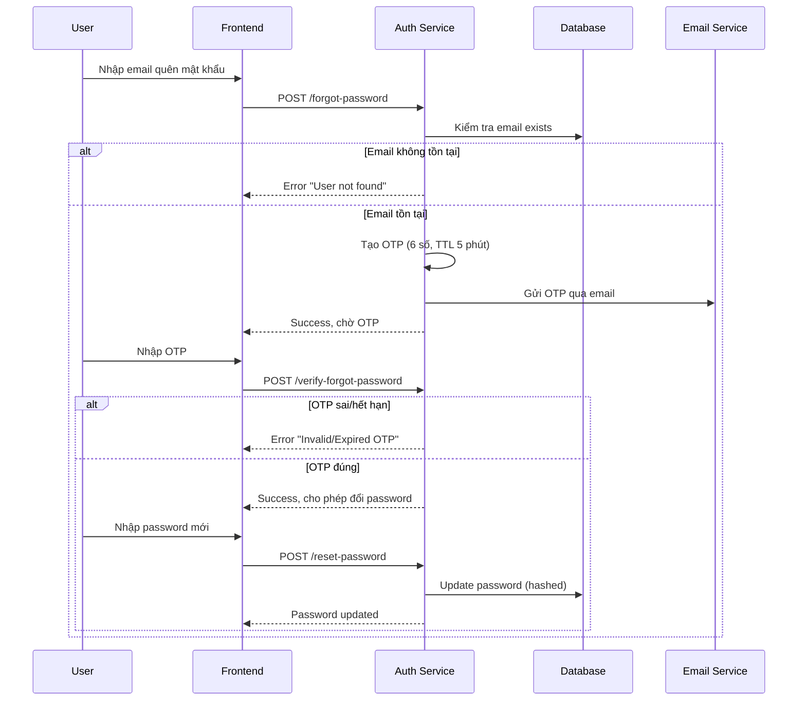
```mermaid
sequenceDiagram
    participant U as User
    participant FE as Frontend
    participant AS as Auth Service
    participant DB as Database
    participant EM as Email Service

    U->>FE: Nhập email quên mật khẩu
    FE->>AS: POST /forgot-password
    AS->>DB: Kiểm tra email exists
    alt Email không tồn tại
        AS-->>FE: Error "User not found"
    else Email tồn tại
        AS->>AS: Tạo OTP (6 số, TTL 5 phút)
        AS->>EM: Gửi OTP qua email
        AS-->>FE: Success, chờ OTP
        U->>FE: Nhập OTP
        FE->>AS: POST /verify-forgot-password
        alt OTP sai/hết hạn
            AS-->>FE: Error "Invalid/Expired OTP"
        else OTP đúng
            AS-->>FE: Success, cho phép đổi password
            U->>FE: Nhập password mới
            FE->>AS: POST /reset-password
            AS->>DB: Update password (hashed)
            AS-->>FE: Password updated
        end
    end
```

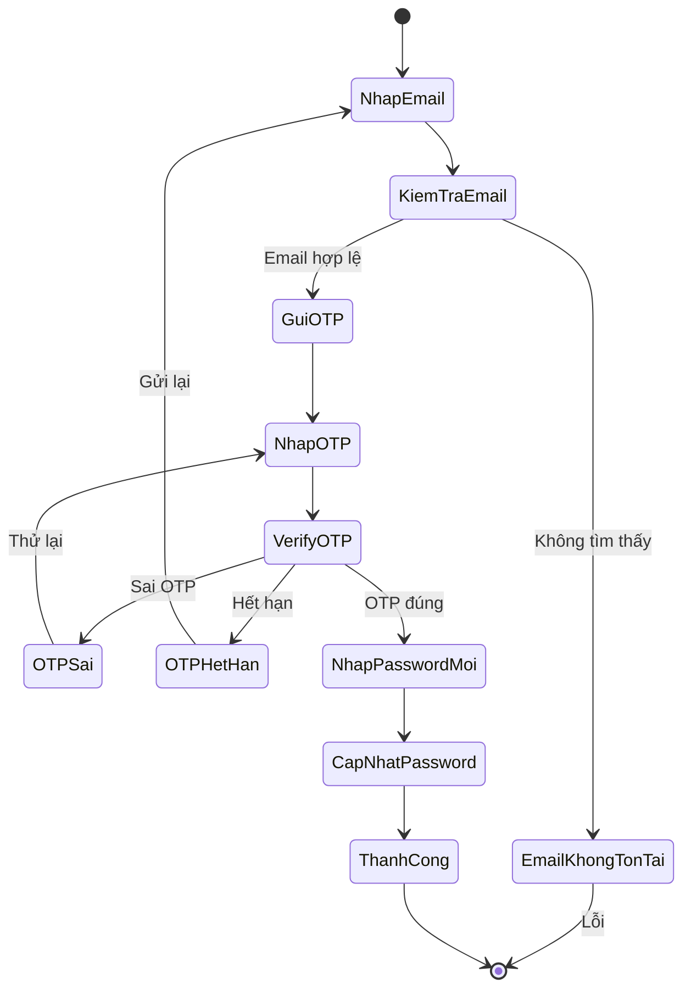
```mermaid
stateDiagram-v2
    [*] --> NhapEmail
    NhapEmail --> KiemTraEmail
    KiemTraEmail --> EmailKhongTonTai: Không tìm thấy
    KiemTraEmail --> GuiOTP: Email hợp lệ
    EmailKhongTonTai --> [*]: Lỗi
    GuiOTP --> NhapOTP
    NhapOTP --> VerifyOTP
    VerifyOTP --> OTPSai: Sai OTP
    VerifyOTP --> OTPHetHan: Hết hạn
    VerifyOTP --> NhapPasswordMoi: OTP đúng
    OTPSai --> NhapOTP: Thử lại
    OTPHetHan --> NhapEmail: Gửi lại
    NhapPasswordMoi --> CapNhatPassword
    CapNhatPassword --> ThanhCong
    ThanhCong --> [*]
```

### UC-04: Quản lý địa chỉ giao hàng

| Thuộc tính         | Chi tiết                       |
| ------------------ | ------------------------------ |
| **Tên**            | Quản lý địa chỉ giao hàng      |
| **Actor**          | User (đã đăng nhập)            |
| **Mô tả**          | Thêm/sửa/xóa địa chỉ giao hàng |
| **Tiền điều kiện** | User đã đăng nhập              |
| **Hậu điều kiện**  | Địa chỉ được lưu vào database  |

**Luồng chính (Thêm địa chỉ):**

1. User vào trang quản lý địa chỉ
2. User click "Add Address"
3. User nhập: name, street, city, zip, country, label (Home/Work/Other)
4. Hệ thống validate dữ liệu
5. Hệ thống lưu địa chỉ vào database
6. Nếu là địa chỉ đầu tiên → set isDefault = true

**Luồng chính (Xóa địa chỉ):**

1. User chọn địa chỉ cần xóa
2. Hệ thống kiểm tra địa chỉ thuộc user
3. Hệ thống xóa địa chỉ khỏi database

**Luồng ngoại lệ:**

- 4a. Dữ liệu không hợp lệ (thiếu field bắt buộc) → Thông báo validation error
- 2a (Xóa). Địa chỉ không tồn tại → "Address not found"
- 2b (Xóa). Địa chỉ không thuộc user → "Unauthorized"

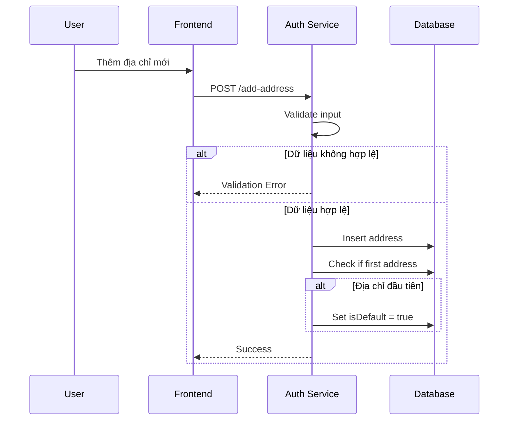
```mermaid
sequenceDiagram
    participant U as User
    participant FE as Frontend
    participant AS as Auth Service
    participant DB as Database

    U->>FE: Thêm địa chỉ mới
    FE->>AS: POST /add-address
    AS->>AS: Validate input
    alt Dữ liệu không hợp lệ
        AS-->>FE: Validation Error
    else Dữ liệu hợp lệ
        AS->>DB: Insert address
        AS->>DB: Check if first address
        alt Địa chỉ đầu tiên
            AS->>DB: Set isDefault = true
        end
        AS-->>FE: Success
    end
```

### UC-05: Cập nhật hồ sơ User

| Thuộc tính         | Chi tiết                             |
| ------------------ | ------------------------------------ |
| **Tên**            | Cập nhật hồ sơ cá nhân               |
| **Actor**          | User (đã đăng nhập)                  |
| **Mô tả**          | Cập nhật thông tin cá nhân và avatar |
| **Tiền điều kiện** | User đã đăng nhập                    |
| **Hậu điều kiện**  | Thông tin được cập nhật              |

**Luồng chính:**

1. User vào trang profile
2. User sửa thông tin (name)
3. Nếu đổi avatar:
   - Upload ảnh mới lên ImageKit
   - Xóa avatar cũ nếu có
4. Hệ thống cập nhật database
5. Trả về user info mới

**Luồng ngoại lệ:**

- 3a. File upload thất bại → "Failed to upload image"
- 3b. File không phải ảnh → "Invalid file type"
- 3c. File quá lớn (>5MB) → "File too large"

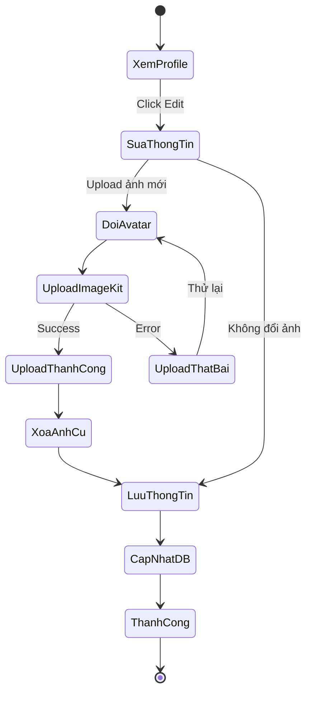
```mermaid
stateDiagram-v2
    [*] --> XemProfile
    XemProfile --> SuaThongTin: Click Edit
    SuaThongTin --> DoiAvatar: Upload ảnh mới
    SuaThongTin --> LuuThongTin: Không đổi ảnh
    DoiAvatar --> UploadImageKit
    UploadImageKit --> UploadThanhCong: Success
    UploadImageKit --> UploadThatBai: Error
    UploadThatBai --> DoiAvatar: Thử lại
    UploadThanhCong --> XoaAnhCu
    XoaAnhCu --> LuuThongTin
    LuuThongTin --> CapNhatDB
    CapNhatDB --> ThanhCong
    ThanhCong --> [*]
```

---

## 4. Use Cases Quản lý Seller

### UC-06: Đăng ký Seller

| Thuộc tính         | Chi tiết                                  |
| ------------------ | ----------------------------------------- |
| **Tên**            | Đăng ký tài khoản Seller                  |
| **Actor**          | Seller mới                                |
| **Mô tả**          | Đăng ký trở thành người bán trên hệ thống |
| **Tiền điều kiện** | Email chưa được đăng ký                   |
| **Hậu điều kiện**  | Tài khoản seller được tạo, chờ tạo shop   |

**Luồng chính:**

1. Seller truy cập trang đăng ký seller
2. Nhập: name, email, password, phone_number, country
3. Hệ thống validate và gửi OTP
4. Seller xác thực OTP
5. Hệ thống tạo tài khoản seller

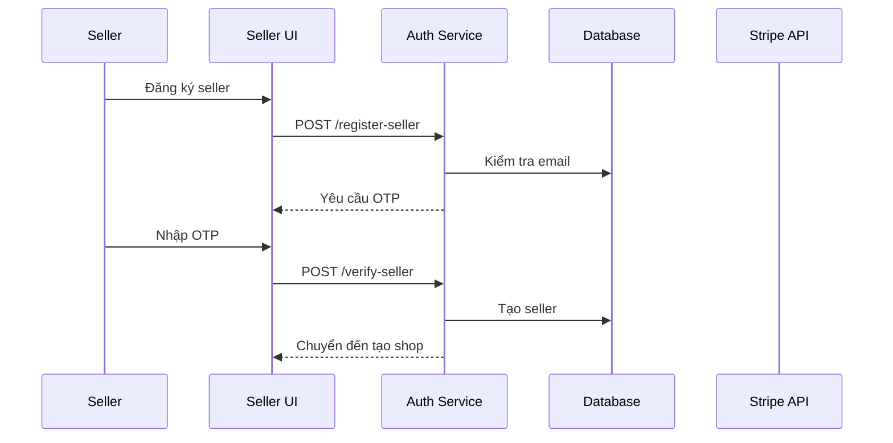
```mermaid
sequenceDiagram
    participant S as Seller
    participant FE as Seller UI
    participant AS as Auth Service
    participant DB as Database
    participant Stripe as Stripe API

    S->>FE: Đăng ký seller
    FE->>AS: POST /register-seller
    AS->>DB: Kiểm tra email
    AS-->>FE: Yêu cầu OTP
    S->>FE: Nhập OTP
    FE->>AS: POST /verify-seller
    AS->>DB: Tạo seller
    AS-->>FE: Chuyển đến tạo shop
```

### UC-07: Tạo cửa hàng (Shop)

| Thuộc tính         | Chi tiết                            |
| ------------------ | ----------------------------------- |
| **Tên**            | Tạo cửa hàng                        |
| **Actor**          | Seller (đã đăng ký)                 |
| **Mô tả**          | Seller tạo shop để bắt đầu bán hàng |
| **Tiền điều kiện** | Seller đã xác thực, chưa có shop    |
| **Hậu điều kiện**  | Shop được tạo, có thể thêm sản phẩm |

**Luồng chính:**

1. Seller nhập thông tin shop: name, bio, category, address
2. Upload ảnh đại diện shop
3. Thêm social links (optional)
4. Hệ thống tạo shop và link với seller

### UC-08: Kết nối Stripe (Thanh toán)

| Thuộc tính         | Chi tiết                                 |
| ------------------ | ---------------------------------------- |
| **Tên**            | Kết nối tài khoản Stripe                 |
| **Actor**          | Seller                                   |
| **Mô tả**          | Seller kết nối Stripe để nhận thanh toán |
| **Tiền điều kiện** | Seller có shop                           |
| **Hậu điều kiện**  | stripeId được lưu cho seller             |

**Luồng chính:**

1. Seller click "Connect Stripe"
2. Hệ thống tạo Stripe Connect account
3. Redirect đến Stripe onboarding
4. Sau khi hoàn tất → callback cập nhật stripeId

### UC-09: Xem Analytics Seller

| Thuộc tính         | Chi tiết                                        |
| ------------------ | ----------------------------------------------- |
| **Tên**            | Xem thống kê cửa hàng                           |
| **Actor**          | Seller (đã đăng nhập)                           |
| **Mô tả**          | Xem các chỉ số về doanh thu, đơn hàng, lượt xem |
| **Tiền điều kiện** | Seller có shop                                  |
| **Hậu điều kiện**  | Không                                           |

**Luồng chính:**

1. Seller truy cập Dashboard
2. Hệ thống tính toán và hiển thị:
   - Tổng doanh thu
   - Số đơn hàng (theo trạng thái)
   - Doanh thu theo tháng
   - Lượt xem shop

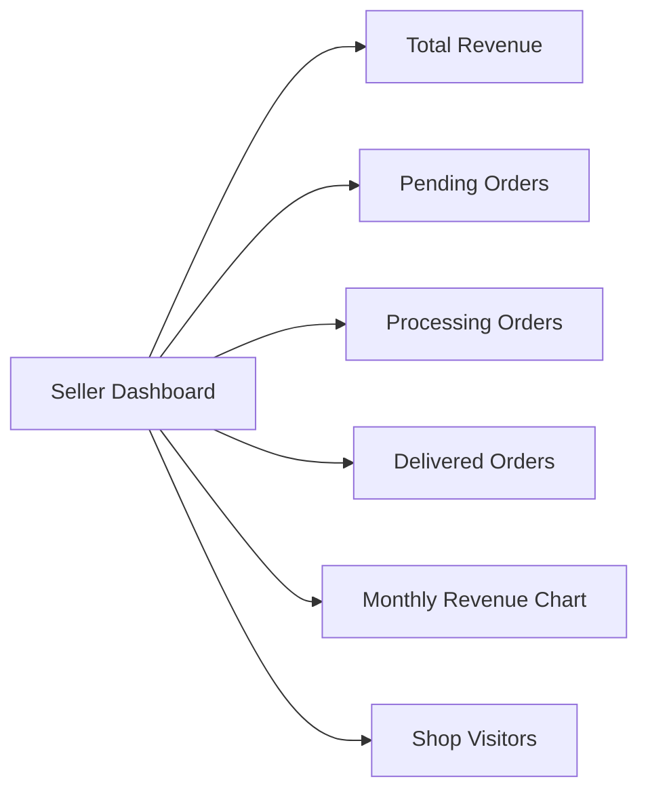
```mermaid
graph LR
    A[Seller Dashboard] --> B[Total Revenue]
    A --> C[Pending Orders]
    A --> D[Processing Orders]
    A --> E[Delivered Orders]
    A --> F[Monthly Revenue Chart]
    A --> G[Shop Visitors]
```

---

## 5. Use Cases Quản lý Sản phẩm

### UC-10: Tạo sản phẩm mới

| Thuộc tính         | Chi tiết                                |
| ------------------ | --------------------------------------- |
| **Tên**            | Tạo sản phẩm mới                        |
| **Actor**          | Seller                                  |
| **Mô tả**          | Seller thêm sản phẩm vào shop           |
| **Tiền điều kiện** | Seller có shop                          |
| **Hậu điều kiện**  | Sản phẩm được tạo với trạng thái Active |

**Luồng chính:**

1. Seller vào trang "Create Product"
2. Upload ảnh (tối đa 5 ảnh) lên ImageKit
3. Nhập thông tin:
   - title, category, sub_category
   - short_description, detailed_description
   - sale_price, regular_price, stock
   - colors, sizes, tags
   - warranty, custom_specifications
4. Hệ thống tạo slug unique từ title
5. Lưu sản phẩm với status = Active

**Luồng ngoại lệ:**

- 4a. Slug đã tồn tại → Thêm random string

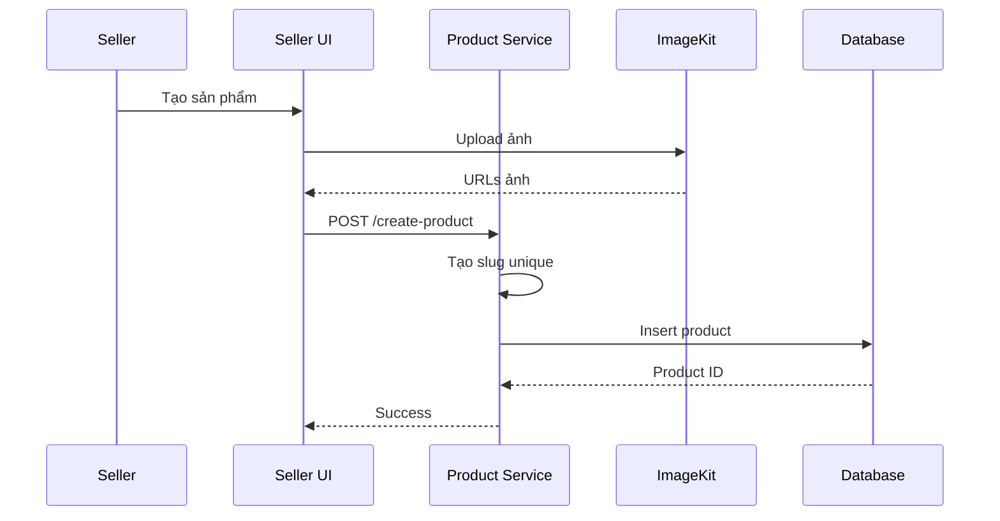
```mermaid
sequenceDiagram
    participant S as Seller
    participant FE as Seller UI
    participant PS as Product Service
    participant IK as ImageKit
    participant DB as Database

    S->>FE: Tạo sản phẩm
    FE->>IK: Upload ảnh
    IK-->>FE: URLs ảnh
    FE->>PS: POST /create-product
    PS->>PS: Tạo slug unique
    PS->>DB: Insert product
    DB-->>PS: Product ID
    PS-->>FE: Success
```

### UC-11: Chỉnh sửa sản phẩm

| Thuộc tính         | Chi tiết                               |
| ------------------ | -------------------------------------- |
| **Tên**            | Chỉnh sửa thông tin sản phẩm           |
| **Actor**          | Seller                                 |
| **Mô tả**          | Cập nhật thông tin sản phẩm đã tồn tại |
| **Tiền điều kiện** | Sản phẩm thuộc shop của seller         |
| **Hậu điều kiện**  | Thông tin được cập nhật                |

**Luồng chính:**

1. Seller chọn sản phẩm từ danh sách
2. Hệ thống load thông tin sản phẩm hiện tại
3. Seller sửa đổi thông tin cần thay đổi
4. Upload/xóa ảnh nếu cần
5. Hệ thống validate và cập nhật database

**Luồng ngoại lệ:**

- 1a. Sản phẩm không thuộc shop → "Unauthorized"
- 4a. Upload ảnh thất bại → Thông báo lỗi, giữ ảnh cũ
- 5a. Validation fail → Hiển thị lỗi cụ thể

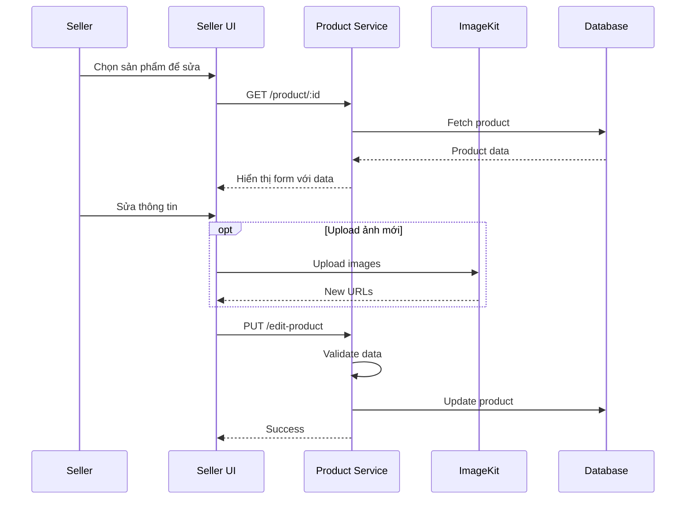
```mermaid
sequenceDiagram
    participant S as Seller
    participant FE as Seller UI
    participant PS as Product Service
    participant IK as ImageKit
    participant DB as Database

    S->>FE: Chọn sản phẩm để sửa
    FE->>PS: GET /product/:id
    PS->>DB: Fetch product
    DB-->>PS: Product data
    PS-->>FE: Hiển thị form với data
    S->>FE: Sửa thông tin
    opt Upload ảnh mới
        FE->>IK: Upload images
        IK-->>FE: New URLs
    end
    FE->>PS: PUT /edit-product
    PS->>PS: Validate data
    PS->>DB: Update product
    PS-->>FE: Success
```

### UC-12: Xóa/Khôi phục sản phẩm

| Thuộc tính         | Chi tiết                                                 |
| ------------------ | -------------------------------------------------------- |
| **Tên**            | Xóa mềm và khôi phục sản phẩm                            |
| **Actor**          | Seller                                                   |
| **Mô tả**          | Đánh dấu sản phẩm là đã xóa (soft delete) hoặc khôi phục |
| **Tiền điều kiện** | Sản phẩm thuộc shop của seller                           |
| **Hậu điều kiện**  | isDeleted được toggle                                    |

**Luồng chính (Xóa):**

1. Seller chọn sản phẩm cần xóa
2. Hệ thống xác nhận quyền sở hữu
3. Hệ thống set isDeleted = true, deletedAt = now()
4. Sản phẩm không hiển thị cho user nhưng vẫn còn trong DB

**Luồng chính (Khôi phục):**

1. Seller chọn sản phẩm đã xóa từ tab "Deleted"
2. Hệ thống set isDeleted = false, deletedAt = null
3. Sản phẩm hiển thị lại bình thường

**Luồng ngoại lệ:**

- 2a. Sản phẩm không thuộc shop → "Unauthorized"
- 1a (Khôi phục). Sản phẩm chưa bị xóa → "Product is not deleted"

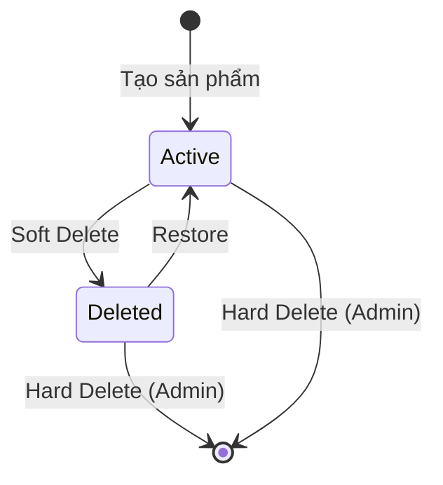
```mermaid
stateDiagram-v2
    [*] --> Active: Tạo sản phẩm
    Active --> Deleted: Soft Delete
    Deleted --> Active: Restore
    Deleted --> [*]: Hard Delete (Admin)
    Active --> [*]: Hard Delete (Admin)
```

### UC-13: Tạo mã giảm giá (Discount Code)

| Thuộc tính         | Chi tiết                 |
| ------------------ | ------------------------ |
| **Tên**            | Tạo mã giảm giá          |
| **Actor**          | Seller                   |
| **Mô tả**          | Tạo coupon code cho shop |
| **Tiền điều kiện** | Seller có shop           |
| **Hậu điều kiện**  | Discount code được lưu   |

**Luồng chính:**

1. Seller vào trang Discount Management
2. Click "Create Discount Code"
3. Nhập thông tin:
   - public_name: Tên hiển thị
   - discountCode: Mã code unique
   - discountType: percentage hoặc fixed
   - discountValue: Giá trị giảm
4. Hệ thống kiểm tra code chưa tồn tại
5. Lưu discount code vào database

**Luồng ngoại lệ:**

- 4a. Code đã tồn tại → "Discount code already exists"
- 3a. discountValue <= 0 → Validation error
- 3b. percentage > 100 → "Discount cannot exceed 100%"

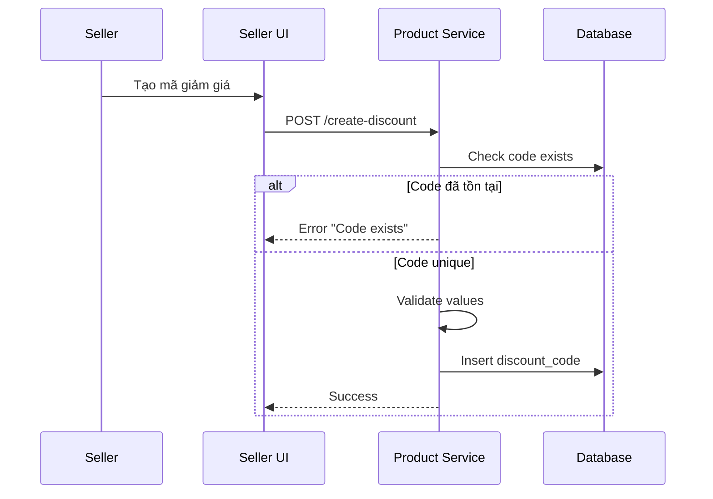
```mermaid
sequenceDiagram
    participant S as Seller
    participant FE as Seller UI
    participant PS as Product Service
    participant DB as Database

    S->>FE: Tạo mã giảm giá
    FE->>PS: POST /create-discount
    PS->>DB: Check code exists
    alt Code đã tồn tại
        PS-->>FE: Error "Code exists"
    else Code unique
        PS->>PS: Validate values
        PS->>DB: Insert discount_code
        PS-->>FE: Success
    end
```

### UC-14: Tạo Event (Khuyến mãi)

| Thuộc tính         | Chi tiết                                    |
| ------------------ | ------------------------------------------- |
| **Tên**            | Tạo sự kiện khuyến mãi                      |
| **Actor**          | Seller                                      |
| **Mô tả**          | Biến sản phẩm thường thành flash sale/event |
| **Tiền điều kiện** | Sản phẩm tồn tại                            |
| **Hậu điều kiện**  | starting_date và ending_date được set       |

**Luồng chính:**

1. Seller chọn sản phẩm để tạo event
2. Nhập thời gian: starting_date, ending_date
3. Có thể điều chỉnh giá sale_price
4. Hệ thống validate thời gian hợp lệ
5. Cập nhật sản phẩm với event info

**Luồng ngoại lệ:**

- 4a. ending_date <= starting_date → "Invalid date range"
- 4b. starting_date trong quá khứ → "Start date must be in future"
- 1a. Sản phẩm đã có event → Cho phép sửa hoặc hủy

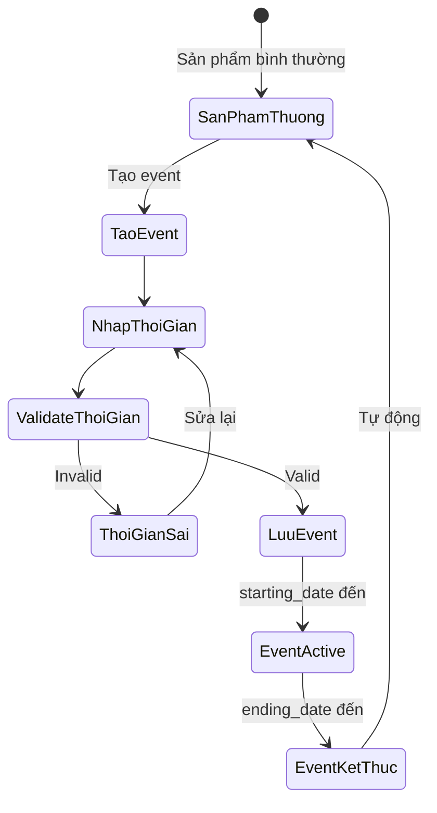
```mermaid
stateDiagram-v2
    [*] --> SanPhamThuong: Sản phẩm bình thường
    SanPhamThuong --> TaoEvent: Tạo event
    TaoEvent --> NhapThoiGian
    NhapThoiGian --> ValidateThoiGian
    ValidateThoiGian --> ThoiGianSai: Invalid
    ValidateThoiGian --> LuuEvent: Valid
    ThoiGianSai --> NhapThoiGian: Sửa lại
    LuuEvent --> EventActive: starting_date đến
    EventActive --> EventKetThuc: ending_date đến
    EventKetThuc --> SanPhamThuong: Tự động
```

### UC-15: Xem và lọc sản phẩm (User)

| Thuộc tính         | Chi tiết                      |
| ------------------ | ----------------------------- |
| **Tên**            | Xem và lọc danh sách sản phẩm |
| **Actor**          | User (không cần đăng nhập)    |
| **Mô tả**          | Duyệt sản phẩm với các bộ lọc |
| **Tiền điều kiện** | Không                         |
| **Hậu điều kiện**  | Không                         |

**Filters hỗ trợ:**

- Category / Sub-category
- Price range (min/max)
- Rating
- Colors / Sizes
- Tags
- Keyword search

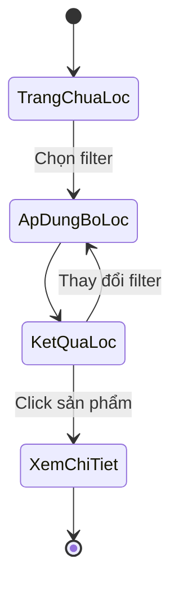
```mermaid
stateDiagram-v2
    [*] --> TrangChuaLoc
    TrangChuaLoc --> ApDungBoLoc: Chọn filter
    ApDungBoLoc --> KetQuaLoc
    KetQuaLoc --> ApDungBoLoc: Thay đổi filter
    KetQuaLoc --> XemChiTiet: Click sản phẩm
    XemChiTiet --> [*]
```

### UC-16: Xem chi tiết sản phẩm

| Thuộc tính         | Chi tiết                              |
| ------------------ | ------------------------------------- |
| **Tên**            | Xem chi tiết sản phẩm                 |
| **Actor**          | User                                  |
| **Mô tả**          | Xem thông tin đầy đủ của một sản phẩm |
| **Tiền điều kiện** | Sản phẩm exist và không bị xóa        |
| **Hậu điều kiện**  | View count được tăng (analytics)      |

**Luồng chính:**

1. User click vào sản phẩm từ danh sách
2. Hệ thống fetch product by slug
3. Tăng view count trong productAnalytics
4. Hiển thị: images, title, price, description, specs
5. Hiển thị thông tin shop

**Luồng ngoại lệ:**

- 2a. Sản phẩm không tồn tại → 404 page
- 2b. Sản phẩm bị xóa (isDeleted=true) → 404 page

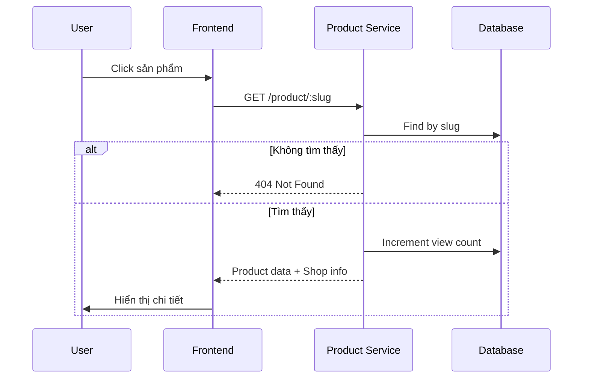
```mermaid
sequenceDiagram
    participant U as User
    participant FE as Frontend
    participant PS as Product Service
    participant DB as Database

    U->>FE: Click sản phẩm
    FE->>PS: GET /product/:slug
    PS->>DB: Find by slug
    alt Không tìm thấy
        PS-->>FE: 404 Not Found
    else Tìm thấy
        PS->>DB: Increment view count
        PS-->>FE: Product data + Shop info
        FE->>U: Hiển thị chi tiết
    end
```

---

## 6. Use Cases Đặt hàng & Thanh toán

### UC-17: Thêm vào giỏ hàng

| Thuộc tính         | Chi tiết                                         |
| ------------------ | ------------------------------------------------ |
| **Tên**            | Thêm sản phẩm vào giỏ hàng                       |
| **Actor**          | User                                             |
| **Mô tả**          | Thêm sản phẩm với options (size, color) vào cart |
| **Tiền điều kiện** | Sản phẩm còn hàng                                |
| **Hậu điều kiện**  | Cart được cập nhật (localStorage hoặc API)       |

**Luồng chính:**

1. User chọn options (size, color, quantity)
2. Click "Add to Cart"
3. Hệ thống kiểm tra stock
4. Thêm item vào cart state
5. Hiển thị thông báo thành công

**Luồng ngoại lệ:**

- 3a. Số lượng > stock → "Only X items available"
- 1a. Options bắt buộc chưa chọn → "Please select size/color"

**Logic cart:**

- User chưa đăng nhập → Lưu localStorage
- User đã đăng nhập → Sync với Redis/DB

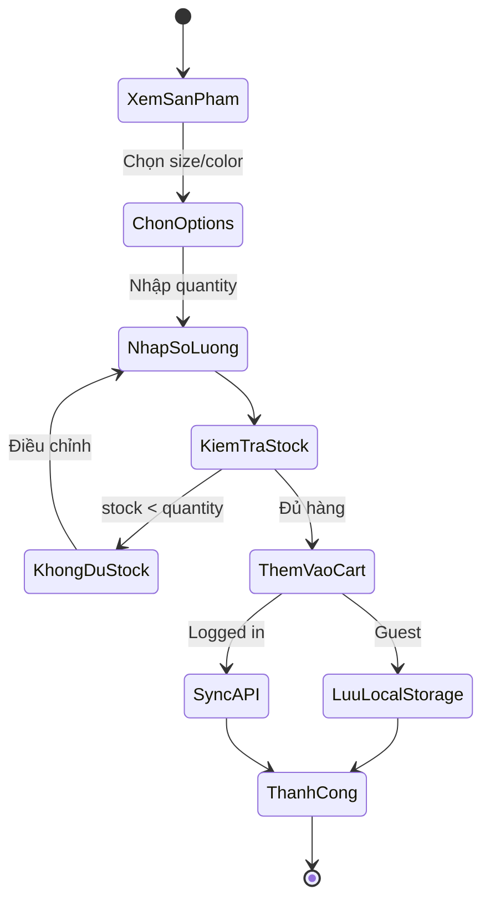
```mermaid
stateDiagram-v2
    [*] --> XemSanPham
    XemSanPham --> ChonOptions: Chọn size/color
    ChonOptions --> NhapSoLuong: Nhập quantity
    NhapSoLuong --> KiemTraStock
    KiemTraStock --> KhongDuStock: stock < quantity
    KiemTraStock --> ThemVaoCart: Đủ hàng
    KhongDuStock --> NhapSoLuong: Điều chỉnh
    ThemVaoCart --> LuuLocalStorage: Guest
    ThemVaoCart --> SyncAPI: Logged in
    LuuLocalStorage --> ThanhCong
    SyncAPI --> ThanhCong
    ThanhCong --> [*]
```

### UC-18: Thanh toán đơn hàng

| Thuộc tính         | Chi tiết                              |
| ------------------ | ------------------------------------- |
| **Tên**            | Thanh toán đơn hàng                   |
| **Actor**          | User (đã đăng nhập)                   |
| **Mô tả**          | Hoàn tất thanh toán qua Stripe        |
| **Tiền điều kiện** | Cart không rỗng, có địa chỉ giao hàng |
| **Hậu điều kiện**  | Order được tạo, stock được trừ        |

**Luồng chính:**

1. User review cart và chọn địa chỉ giao hàng
2. User nhập coupon code (optional)
3. Hệ thống tính tổng (apply discount nếu có)
4. Hệ thống tạo Stripe Checkout Session
5. Redirect sang Stripe payment page
6. Sau thanh toán → callback /verify-payment
7. Hệ thống tạo order, trừ stock, gửi email

**Luồng ngoại lệ:**

- 1a. Cart rỗng → Redirect về trang chủ
- 1b. Chưa có địa chỉ → Yêu cầu thêm địa chỉ
- 6a. Thanh toán thất bại → Hiển thị lỗi, giữ cart

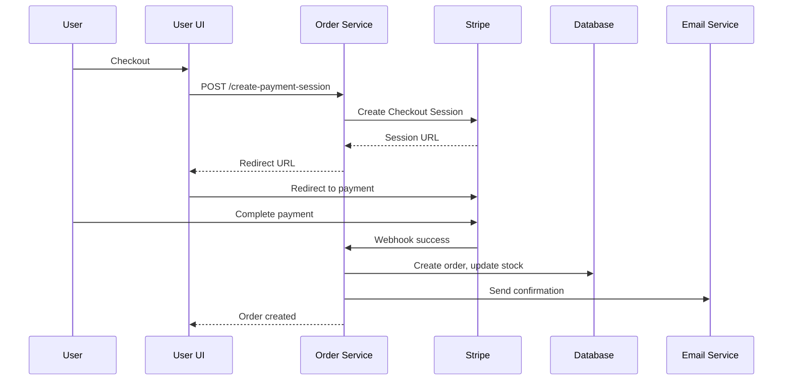
```mermaid
sequenceDiagram
    participant U as User
    participant FE as User UI
    participant OS as Order Service
    participant Stripe as Stripe
    participant DB as Database
    participant Email as Email Service

    U->>FE: Checkout
    FE->>OS: POST /create-payment-session
    OS->>Stripe: Create Checkout Session
    Stripe-->>OS: Session URL
    OS-->>FE: Redirect URL
    FE->>Stripe: Redirect to payment
    U->>Stripe: Complete payment
    Stripe->>OS: Webhook success
    OS->>DB: Create order, update stock
    OS->>Email: Send confirmation
    OS-->>FE: Order created
```

### UC-19: Xác thực mã giảm giá

| Thuộc tính         | Chi tiết                        |
| ------------------ | ------------------------------- |
| **Tên**            | Xác thực coupon code            |
| **Actor**          | User                            |
| **Mô tả**          | Kiểm tra và áp dụng mã giảm giá |
| **Tiền điều kiện** | Code tồn tại và còn hạn         |
| **Hậu điều kiện**  | Discount được áp dụng vào order |

**Luồng chính:**

1. User nhập coupon code
2. Hệ thống tìm kiếm trong discount_codes
3. Tính giá trị discount dựa trên type (percentage/fixed)
4. Áp dụng vào tổng đơn hàng

**Luồng ngoại lệ:**

- 2a. Code không tồn tại → "Invalid coupon code"
- 3a. Discount > total → Discount = total (không âm)

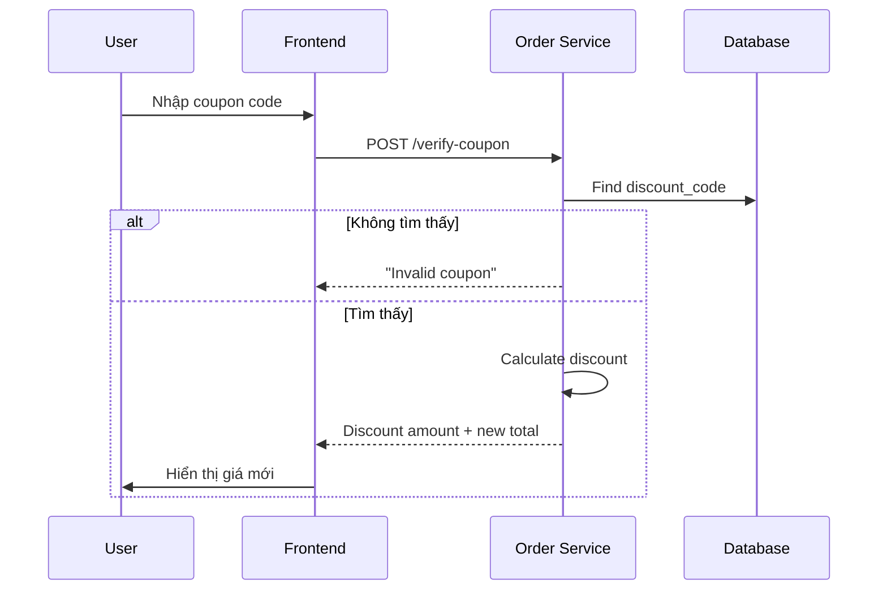
```mermaid
sequenceDiagram
    participant U as User
    participant FE as Frontend
    participant OS as Order Service
    participant DB as Database

    U->>FE: Nhập coupon code
    FE->>OS: POST /verify-coupon
    OS->>DB: Find discount_code
    alt Không tìm thấy
        OS-->>FE: "Invalid coupon"
    else Tìm thấy
        OS->>OS: Calculate discount
        OS-->>FE: Discount amount + new total
        FE->>U: Hiển thị giá mới
    end
```

### UC-20: Xem lịch sử đơn hàng (User)

| Thuộc tính         | Chi tiết                          |
| ------------------ | --------------------------------- |
| **Tên**            | Xem lịch sử đơn hàng              |
| **Actor**          | User (đã đăng nhập)               |
| **Mô tả**          | Xem danh sách các đơn hàng đã đặt |
| **Tiền điều kiện** | User đã đăng nhập                 |
| **Hậu điều kiện**  | Không                             |

**Luồng chính:**

1. User vào trang "My Orders"
2. Hệ thống fetch orders theo userId
3. Hiển thị danh sách với: order ID, date, total, status
4. User có thể click để xem chi tiết

**Luồng ngoại lệ:**

- 2a. Chưa có đơn hàng → Hiển thị empty state

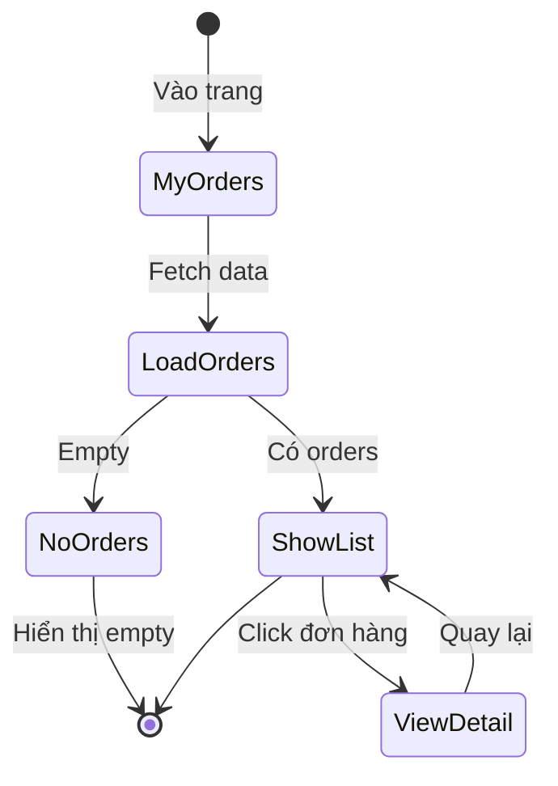
```mermaid
stateDiagram-v2
    [*] --> MyOrders: Vào trang
    MyOrders --> LoadOrders: Fetch data
    LoadOrders --> NoOrders: Empty
    LoadOrders --> ShowList: Có orders
    NoOrders --> [*]: Hiển thị empty
    ShowList --> ViewDetail: Click đơn hàng
    ViewDetail --> ShowList: Quay lại
    ShowList --> [*]
```

### UC-21: Quản lý đơn hàng (Seller)

| Thuộc tính         | Chi tiết                          |
| ------------------ | --------------------------------- |
| **Tên**            | Quản lý đơn hàng cửa hàng         |
| **Actor**          | Seller                            |
| **Mô tả**          | Xem, cập nhật trạng thái đơn hàng |
| **Tiền điều kiện** | Đơn hàng thuộc shop của seller    |
| **Hậu điều kiện**  | Trạng thái được cập nhật          |

**Delivery Status options:**

- Ordered → Processing → Shipped → Delivered
- Ordered → Cancelled

```mermaid
stateDiagram-v2
    [*] --> Ordered
    Ordered --> Processing: Seller xác nhận
    Processing --> Shipped: Đã giao vận chuyển
    Shipped --> Delivered: Khách nhận hàng
    Ordered --> Cancelled: Hủy đơn
    Delivered --> [*]
    Cancelled --> [*]
```

---

## 7. Use Cases Chat & Nhắn tin

### UC-22: Bắt đầu cuộc trò chuyện

| Thuộc tính         | Chi tiết                     |
| ------------------ | ---------------------------- |
| **Tên**            | Tạo cuộc trò chuyện mới      |
| **Actor**          | User                         |
| **Mô tả**          | User bắt đầu chat với seller |
| **Tiền điều kiện** | User đã đăng nhập            |
| **Hậu điều kiện**  | Conversation được tạo        |

**Luồng chính:**

1. User click "Chat with seller" trên shop page
2. Hệ thống kiểm tra conversation existing
3. Nếu chưa có → tạo mới với participants
4. Mở giao diện chat

### UC-23: Gửi tin nhắn Real-time

| Thuộc tính         | Chi tiết                                         |
| ------------------ | ------------------------------------------------ |
| **Tên**            | Gửi và nhận tin nhắn real-time                   |
| **Actor**          | User, Seller                                     |
| **Mô tả**          | Nhắn tin qua WebSocket với persistence qua Kafka |
| **Tiền điều kiện** | WebSocket connected                              |
| **Hậu điều kiện**  | Message được lưu và delivered                    |

```mermaid
sequenceDiagram
    participant U as User
    participant WS as WebSocket Server
    participant K as Kafka
    participant DB as Database
    participant S as Seller

    U->>WS: Connect (register user_id)
    WS->>WS: Store connection
    U->>WS: Send message
    WS->>K: Produce to chat.new_messages
    K->>DB: Consumer saves message
    WS->>S: Push message (if online)
    WS->>U: Echo message
```

### UC-24: Xem lịch sử tin nhắn

| Thuộc tính         | Chi tiết                             |
| ------------------ | ------------------------------------ |
| **Tên**            | Xem lịch sử tin nhắn                 |
| **Actor**          | User, Seller                         |
| **Mô tả**          | Load tin nhắn cũ của cuộc trò chuyện |
| **Tiền điều kiện** | Là participant của conversation      |
| **Hậu điều kiện**  | Unseen count được reset              |

**Luồng chính:**

1. User/Seller mở conversation
2. Hệ thống fetch messages từ database
3. Hiển thị tin nhắn theo thứ tự thời gian
4. Reset unseen count về 0
5. Cập nhật lastSeenAt

**Luồng ngoại lệ:**

- 2a. Không có tin nhắn → Hiển thị empty chat

---

## 8. Use Cases Quản trị Admin

### UC-25: Đăng nhập Admin

| Thuộc tính         | Chi tiết                         |
| ------------------ | -------------------------------- |
| **Tên**            | Đăng nhập quản trị               |
| **Actor**          | Admin                            |
| **Mô tả**          | Admin đăng nhập với role = admin |
| **Tiền điều kiện** | User có role admin               |
| **Hậu điều kiện**  | Admin token được cấp             |

**Luồng chính:**

1. Admin nhập email/password
2. Hệ thống xác thực credentials
3. Kiểm tra role = "admin"
4. Tạo admin access token
5. Redirect vào Admin Dashboard

**Luồng ngoại lệ:**

- 2a. Email/password sai → "Invalid credentials"
- 3a. User không phải admin → "Access denied"

### UC-26: Quản lý Users

| Thuộc tính         | Chi tiết                                |
| ------------------ | --------------------------------------- |
| **Tên**            | Quản lý người dùng                      |
| **Actor**          | Admin                                   |
| **Mô tả**          | Xem danh sách, filter, phân trang users |
| **Tiền điều kiện** | Admin đã đăng nhập                      |
| **Hậu điều kiện**  | Không                                   |

**Luồng chính:**

1. Admin vào trang Users Management
2. Hệ thống fetch danh sách users với pagination
3. Admin có thể filter theo name, email
4. Click user để xem chi tiết + orders

**Chức năng:**

- Xem danh sách users với pagination
- Filter theo: name, email, status
- Xem chi tiết và orders của user

### UC-27: Quản lý Sellers

| Thuộc tính         | Chi tiết                |
| ------------------ | ----------------------- |
| **Tên**            | Quản lý người bán       |
| **Actor**          | Admin                   |
| **Mô tả**          | Xem, kiểm duyệt sellers |
| **Tiền điều kiện** | Admin đã đăng nhập      |
| **Hậu điều kiện**  | Không                   |

**Luồng chính:**

1. Admin vào trang Sellers Management
2. Hệ thống fetch danh sách sellers
3. Hiển thị: name, email, shop info, Stripe status
4. Admin có thể filter và xem chi tiết

### UC-28: Quản lý sản phẩm hệ thống

| Thuộc tính         | Chi tiết                                       |
| ------------------ | ---------------------------------------------- |
| **Tên**            | Quản lý tất cả sản phẩm                        |
| **Actor**          | Admin                                          |
| **Mô tả**          | Xem, filter, kiểm duyệt sản phẩm toàn hệ thống |
| **Tiền điều kiện** | Admin đã đăng nhập                             |
| **Hậu điều kiện**  | Không                                          |

**Luồng chính:**

1. Admin vào trang Products Management
2. Hệ thống fetch tất cả products
3. Filter theo: category, shop, status, price range
4. Xem chi tiết sản phẩm

### UC-29: Quản lý đơn hàng hệ thống

| Thuộc tính         | Chi tiết                           |
| ------------------ | ---------------------------------- |
| **Tên**            | Quản lý tất cả đơn hàng            |
| **Actor**          | Admin                              |
| **Mô tả**          | Xem tổng quan orders toàn hệ thống |
| **Tiền điều kiện** | Admin đã đăng nhập                 |
| **Hậu điều kiện**  | Không                              |

**Luồng chính:**

1. Admin vào trang Orders Management
2. Hệ thống fetch tất cả orders
3. Hiển thị: order ID, user, shop, total, status
4. Filter theo: status, date range, shop

### UC-30: Cấu hình Site

| Thuộc tính         | Chi tiết                                 |
| ------------------ | ---------------------------------------- |
| **Tên**            | Cấu hình website                         |
| **Actor**          | Admin                                    |
| **Mô tả**          | Quản lý categories, banners, site config |
| **Tiền điều kiện** | Admin đã đăng nhập                       |
| **Hậu điều kiện**  | Config được cập nhật và cache            |

**Luồng chính:**

1. Admin vào trang Site Configuration
2. Hệ thống fetch current config từ site_config
3. Admin có thể:
   - Thêm/sửa/xóa categories và subcategories
   - Upload banner images
   - Cập nhật site settings
4. Hệ thống lưu và refresh cache

**Luồng ngoại lệ:**

- 3a. Upload image thất bại → Thông báo lỗi
- 4a. Lưu thất bại → Rollback changes

```mermaid
sequenceDiagram
    participant A as Admin
    participant FE as Admin UI
    participant AS as Admin Service
    participant IK as ImageKit
    participant DB as Database
    participant Cache as Redis Cache

    A->>FE: Mở Site Config
    FE->>AS: GET /customizations
    AS->>DB: Fetch site_config
    AS-->>FE: Current config
    A->>FE: Cập nhật config
    opt Upload banner
        FE->>IK: Upload image
        IK-->>FE: Image URL
    end
    FE->>AS: PUT /update-site-config
    AS->>DB: Update config
    AS->>Cache: Invalidate cache
    AS-->>FE: Success
```

### UC-31: Thêm/Xóa Admin

| Thuộc tính         | Chi tiết                  |
| ------------------ | ------------------------- |
| **Tên**            | Quản lý Admin users       |
| **Actor**          | Admin                     |
| **Mô tả**          | Thêm hoặc xóa quyền admin |
| **Tiền điều kiện** | Admin đã đăng nhập        |
| **Hậu điều kiện**  | User role được cập nhật   |

**Luồng chính (Thêm Admin):**

1. Admin vào trang Admin Management
2. Nhập email của user cần cấp quyền admin
3. Hệ thống kiểm tra user tồn tại
4. Cập nhật role = "admin"

**Luồng chính (Xóa Admin):**

1. Admin chọn admin cần xóa quyền
2. Hệ thống cập nhật role = "user"

**Luồng ngoại lệ:**

- 3a. User không tồn tại → "User not found"
- 1a (Xóa). Không thể xóa chính mình → "Cannot remove yourself"

```mermaid
stateDiagram-v2
    [*] --> AdminList: Xem danh sách admins
    AdminList --> AddAdmin: Thêm admin
    AddAdmin --> EnterEmail: Nhập email
    EnterEmail --> CheckUser: Kiểm tra user
    CheckUser --> UserNotFound: Không tìm thấy
    CheckUser --> UpdateRole: Tìm thấy
    UserNotFound --> EnterEmail: Thử lại
    UpdateRole --> Success: role = admin
    Success --> AdminList

    AdminList --> RemoveAdmin: Xóa admin
    RemoveAdmin --> CheckSelf: Kiểm tra không phải mình
    CheckSelf --> CannotRemove: Là chính mình
    CheckSelf --> UpdateToUser: Không phải
    CannotRemove --> AdminList: Lỗi
    UpdateToUser --> Success2: role = user
    Success2 --> AdminList
```

---

## 9. Sơ đồ hoạt động tổng quan

### 9.1 Flow Mua hàng hoàn chỉnh (Customer Journey)

```mermaid
stateDiagram-v2
    [*] --> BrowseProducts: User truy cập
    BrowseProducts --> ViewProduct: Xem chi tiết
    ViewProduct --> AddToCart: Thêm vào giỏ
    AddToCart --> ViewCart: Xem giỏ hàng
    ViewCart --> Login: Đăng nhập (nếu chưa)
    Login --> Checkout: Tiến hành thanh toán
    ViewCart --> Checkout: Đã đăng nhập
    Checkout --> SelectAddress: Chọn địa chỉ
    SelectAddress --> ApplyCoupon: Áp dụng mã giảm giá
    ApplyCoupon --> Payment: Thanh toán Stripe
    Payment --> OrderCreated: Thành công
    Payment --> PaymentFailed: Thất bại
    PaymentFailed --> ViewCart: Quay lại
    OrderCreated --> [*]
```

### 9.2 Flow Seller Onboarding

```mermaid
stateDiagram-v2
    [*] --> RegisterSeller: Đăng ký
    RegisterSeller --> VerifyOTP: Xác thực OTP
    VerifyOTP --> CreateShop: Tạo cửa hàng
    CreateShop --> ConnectStripe: Kết nối Stripe
    ConnectStripe --> AddProducts: Thêm sản phẩm
    AddProducts --> GoLive: Bắt đầu bán
    GoLive --> [*]
```

### 9.3 Flow Xử lý đơn hàng (Order Processing)

```mermaid
stateDiagram-v2
    [*] --> OrderReceived: Đơn hàng mới
    OrderReceived --> SellerNotified: Thông báo Seller
    SellerNotified --> SellerConfirm: Seller xác nhận
    SellerConfirm --> Processing: Đang xử lý
    Processing --> Packing: Đóng gói
    Packing --> Shipping: Giao vận chuyển
    Shipping --> InTransit: Đang vận chuyển
    InTransit --> Delivered: Giao thành công
    Delivered --> [*]

    SellerNotified --> Cancelled: Seller từ chối
    Processing --> Cancelled: Hủy đơn
    Cancelled --> RefundProcess: Hoàn tiền
    RefundProcess --> [*]
```

### 9.4 Flow Chat Real-time

```mermaid
stateDiagram-v2
    [*] --> UserOnline: User mở app
    UserOnline --> ConnectWS: Kết nối WebSocket
    ConnectWS --> RegisterUser: Đăng ký user_id
    RegisterUser --> Ready: Sẵn sàng chat

    Ready --> SelectConversation: Chọn cuộc trò chuyện
    SelectConversation --> LoadHistory: Load tin nhắn cũ
    LoadHistory --> ChatActive: Chat đang hoạt động

    ChatActive --> TypeMessage: Nhập tin nhắn
    TypeMessage --> SendMessage: Gửi
    SendMessage --> ProduceKafka: Lưu qua Kafka
    ProduceKafka --> DeliverToReceiver: Push tới người nhận
    DeliverToReceiver --> ChatActive: Tiếp tục

    ChatActive --> ReceiveMessage: Nhận tin nhắn mới
    ReceiveMessage --> UpdateUI: Hiển thị
    UpdateUI --> ChatActive

    Ready --> Disconnect: Thoát
    Disconnect --> [*]
```

### 9.5 Flow User Authentication

```mermaid
stateDiagram-v2
    [*] --> Guest: Chưa đăng nhập

    Guest --> RegisterFlow: Đăng ký mới
    RegisterFlow --> EnterInfo: Nhập thông tin
    EnterInfo --> SendOTP: Gửi OTP
    SendOTP --> VerifyOTP: Xác thực
    VerifyOTP --> CreateAccount: Tạo tài khoản
    CreateAccount --> LoggedIn: Đăng nhập thành công

    Guest --> LoginFlow: Đăng nhập
    LoginFlow --> EnterCredentials: Nhập email/password
    EnterCredentials --> ValidateCredentials: Xác thực
    ValidateCredentials --> InvalidCredentials: Sai thông tin
    InvalidCredentials --> EnterCredentials: Thử lại
    ValidateCredentials --> GenerateTokens: Tạo tokens
    GenerateTokens --> LoggedIn

    LoggedIn --> AccessProtected: Truy cập tính năng
    LoggedIn --> Logout: Đăng xuất
    Logout --> Guest

    LoggedIn --> TokenExpired: Token hết hạn
    TokenExpired --> RefreshToken: Refresh
    RefreshToken --> LoggedIn: Thành công
    RefreshToken --> Guest: Thất bại

    LoggedIn --> [*]
```

### 9.6 Flow Admin System Management

```mermaid
stateDiagram-v2
    [*] --> AdminLogin: Admin đăng nhập
    AdminLogin --> AdminDashboard: Vào dashboard

    AdminDashboard --> ManageUsers: Quản lý users
    ManageUsers --> ViewUserList: Xem danh sách
    ViewUserList --> FilterUsers: Filter/Search
    FilterUsers --> ViewUserDetail: Xem chi tiết
    ViewUserDetail --> AdminDashboard: Quay lại

    AdminDashboard --> ManageSellers: Quản lý sellers
    ManageSellers --> ViewSellerList: Xem danh sách
    ViewSellerList --> ViewShopInfo: Xem shop
    ViewShopInfo --> AdminDashboard

    AdminDashboard --> ManageProducts: Quản lý sản phẩm
    ManageProducts --> ViewAllProducts: Xem tất cả SP
    ViewAllProducts --> FilterProducts: Filter
    FilterProducts --> AdminDashboard

    AdminDashboard --> ManageOrders: Quản lý đơn hàng
    ManageOrders --> ViewOrderStats: Thống kê
    ViewOrderStats --> AdminDashboard

    AdminDashboard --> SiteConfig: Cấu hình site
    SiteConfig --> ManageCategories: Quản lý danh mục
    SiteConfig --> ManageBanners: Quản lý banners
    SiteConfig --> AdminDashboard

    AdminDashboard --> ManageAdmins: Quản lý admins
    ManageAdmins --> AddAdmin: Thêm admin
    ManageAdmins --> RemoveAdmin: Xóa admin
    AddAdmin --> AdminDashboard
    RemoveAdmin --> AdminDashboard

    AdminDashboard --> [*]: Đăng xuất
```

### 9.7 Flow Product Lifecycle

```mermaid
stateDiagram-v2
    [*] --> Draft: Tạo sản phẩm (Draft)
    Draft --> PendingReview: Submit để review
    PendingReview --> Active: Duyệt
    PendingReview --> Draft: Từ chối (sửa lại)

    Active --> OnSale: Đang bán
    OnSale --> OutOfStock: Hết hàng
    OutOfStock --> OnSale: Nhập thêm stock

    OnSale --> EventActive: Tạo event/sale
    EventActive --> OnSale: Event kết thúc

    Active --> SoftDeleted: Xóa mềm
    SoftDeleted --> Active: Khôi phục
    SoftDeleted --> HardDeleted: Xóa vĩnh viễn
    HardDeleted --> [*]

    OnSale --> [*]: Ngừng bán
```

### 9.8 Flow Payment Processing

```mermaid
sequenceDiagram
    participant U as User
    participant FE as Frontend
    participant OS as Order Service
    participant Stripe as Stripe
    participant DB as Database
    participant Seller as Seller Stripe

    U->>FE: Checkout
    FE->>OS: Calculate total
    OS->>OS: Apply coupon if any
    OS-->>FE: Final amount

    FE->>OS: Create payment session
    OS->>Stripe: Create Checkout Session
    Note over Stripe: application_fee for platform
    Stripe-->>OS: Session URL
    OS-->>FE: Redirect URL

    FE->>Stripe: User pays
    Stripe->>Stripe: Process payment

    alt Payment Success
        Stripe->>OS: Webhook: payment_success
        OS->>DB: Create order
        OS->>DB: Decrement stock
        OS->>Stripe: Transfer to Seller
        Stripe->>Seller: Funds transferred
        OS-->>FE: Success page
    else Payment Failed
        Stripe->>OS: Webhook: payment_failed
        OS-->>FE: Error page
    end
```

---

## 10. Ma trận Use Case - Actor

| Use Case                   | User | Seller | Admin | System |
| -------------------------- | :--: | :----: | :---: | :----: |
| UC-01: Đăng ký User        |  ✓   |        |       |        |
| UC-02: Đăng nhập User      |  ✓   |        |       |        |
| UC-03: Quên mật khẩu       |  ✓   |   ✓    |       |        |
| UC-04: Quản lý địa chỉ     |  ✓   |        |       |        |
| UC-05: Cập nhật profile    |  ✓   |        |       |        |
| UC-06: Đăng ký Seller      |      |   ✓    |       |        |
| UC-07: Tạo Shop            |      |   ✓    |       |        |
| UC-08: Kết nối Stripe      |      |   ✓    |       |        |
| UC-09: Xem Analytics       |      |   ✓    |       |        |
| UC-10: Tạo sản phẩm        |      |   ✓    |       |        |
| UC-11: Chỉnh sửa sản phẩm  |      |   ✓    |       |        |
| UC-12: Xóa/Khôi phục SP    |      |   ✓    |       |        |
| UC-13: Tạo mã giảm giá     |      |   ✓    |       |        |
| UC-14: Tạo Event           |      |   ✓    |       |        |
| UC-15: Xem/Lọc sản phẩm    |  ✓   |   ✓    |   ✓   |        |
| UC-16: Xem chi tiết SP     |  ✓   |   ✓    |   ✓   |        |
| UC-17: Thêm vào giỏ        |  ✓   |        |       |        |
| UC-18: Thanh toán          |  ✓   |        |       |        |
| UC-19: Verify coupon       |  ✓   |        |       |        |
| UC-20: Xem lịch sử đơn     |  ✓   |        |       |        |
| UC-21: Quản lý đơn hàng    |      |   ✓    |       |        |
| UC-22: Bắt đầu chat        |  ✓   |        |       |        |
| UC-23: Gửi tin nhắn        |  ✓   |   ✓    |       |        |
| UC-24: Xem lịch sử chat    |  ✓   |   ✓    |       |        |
| UC-25: Đăng nhập Admin     |      |        |   ✓   |        |
| UC-26: Quản lý Users       |      |        |   ✓   |        |
| UC-27: Quản lý Sellers     |      |        |   ✓   |        |
| UC-28: Quản lý SP hệ thống |      |        |   ✓   |        |
| UC-29: Quản lý đơn hàng    |      |        |   ✓   |        |
| UC-30: Cấu hình Site       |      |        |   ✓   |        |
| UC-31: Quản lý Admin       |      |        |   ✓   |        |

---

## 11. Appendix: Công nghệ sử dụng

| Component        | Technology                        |
| ---------------- | --------------------------------- |
| Frontend User    | Next.js 14, React, Zustand        |
| Frontend Seller  | Next.js 14, React, TanStack Query |
| Frontend Admin   | Next.js 14, React                 |
| API Gateway      | Express.js, express-http-proxy    |
| Auth Service     | Express.js, JWT, bcrypt           |
| Product Service  | Express.js, Prisma                |
| Order Service    | Express.js, Stripe API            |
| Chatting Service | WebSocket (ws), Kafka             |
| Database         | MongoDB + Prisma ORM              |
| Cache            | Redis                             |
| Image Storage    | ImageKit                          |
| Message Queue    | Apache Kafka                      |
| Email            | Resend API                        |
| Rate Limiting    | express-rate-limit                |

---

_Tài liệu được tạo tự động từ source code analysis_
_Cập nhật: 05/01/2026_
